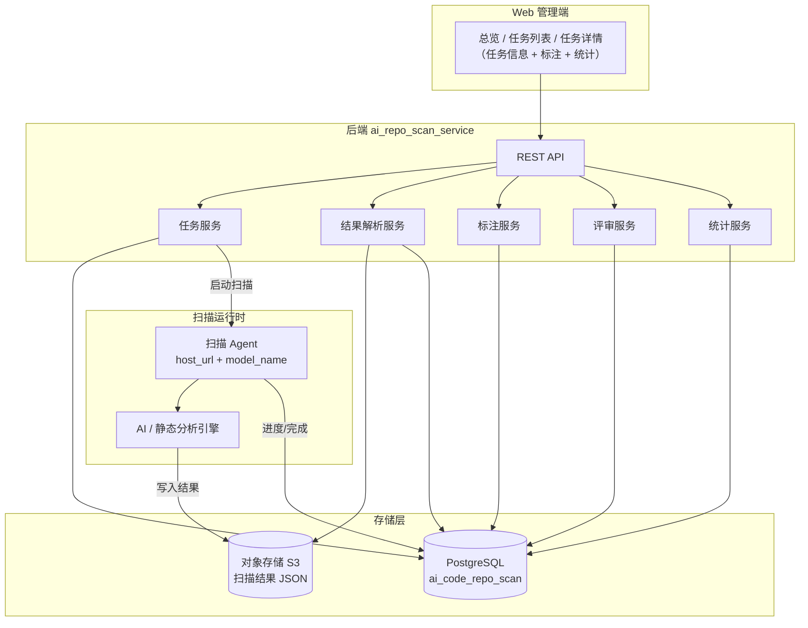
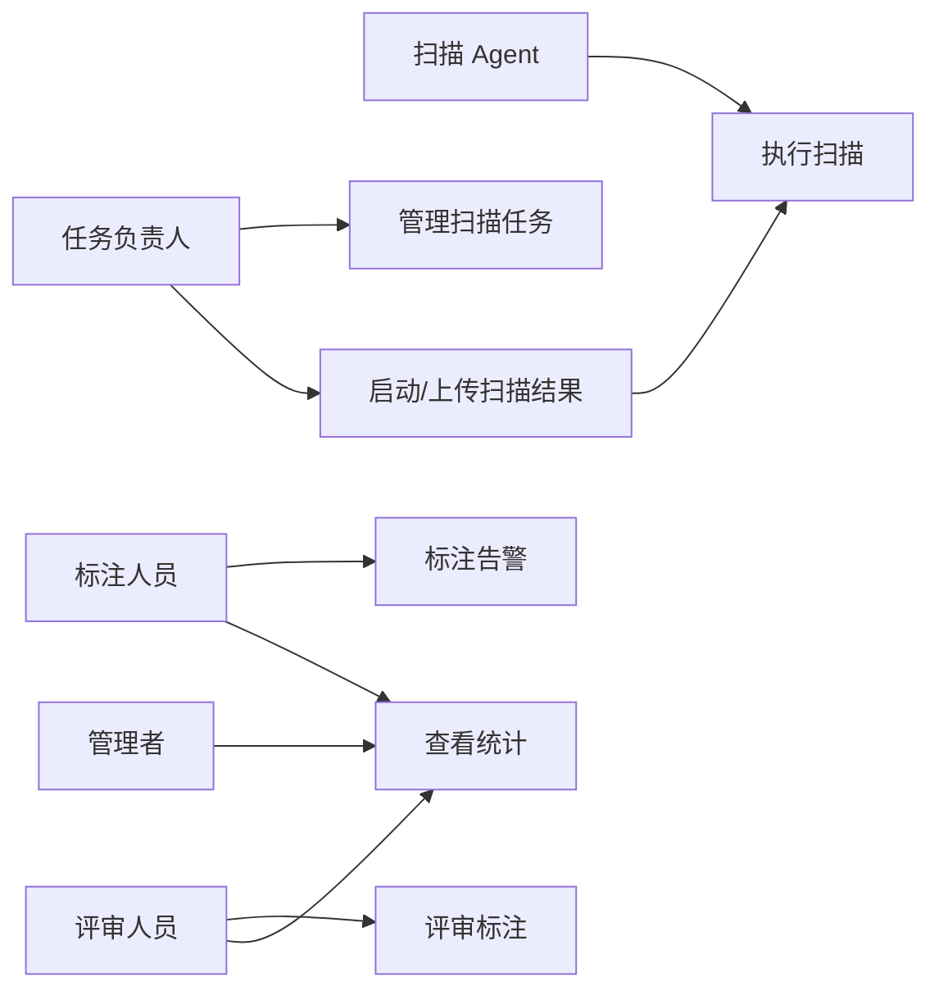
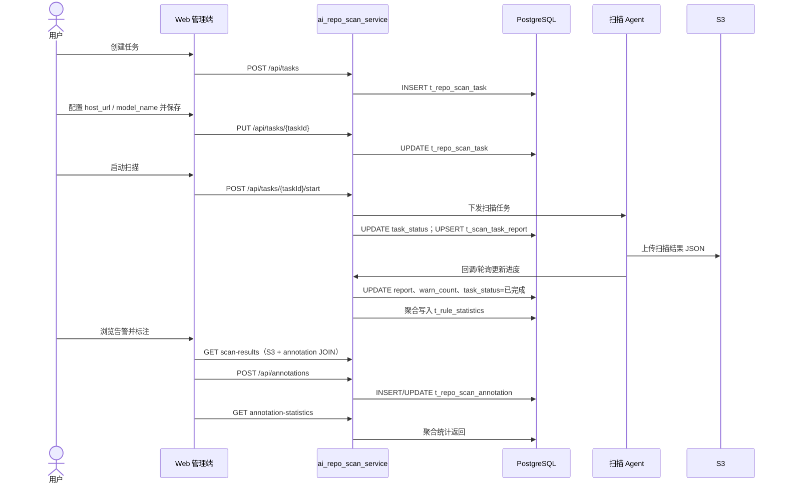
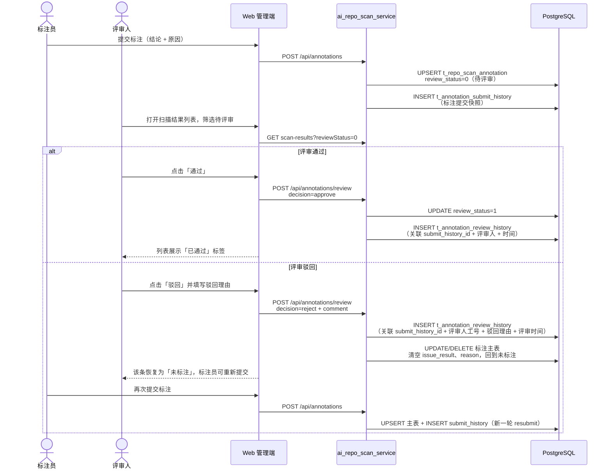
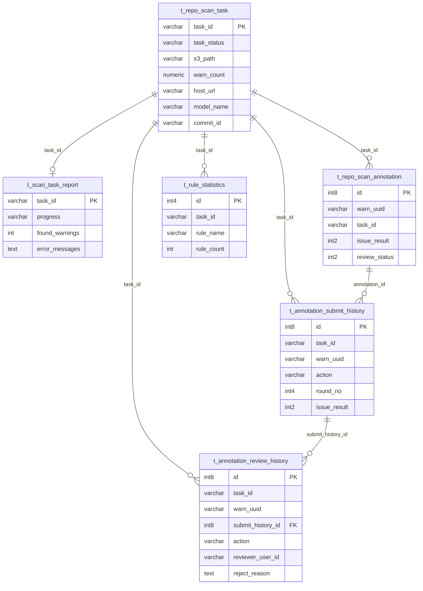
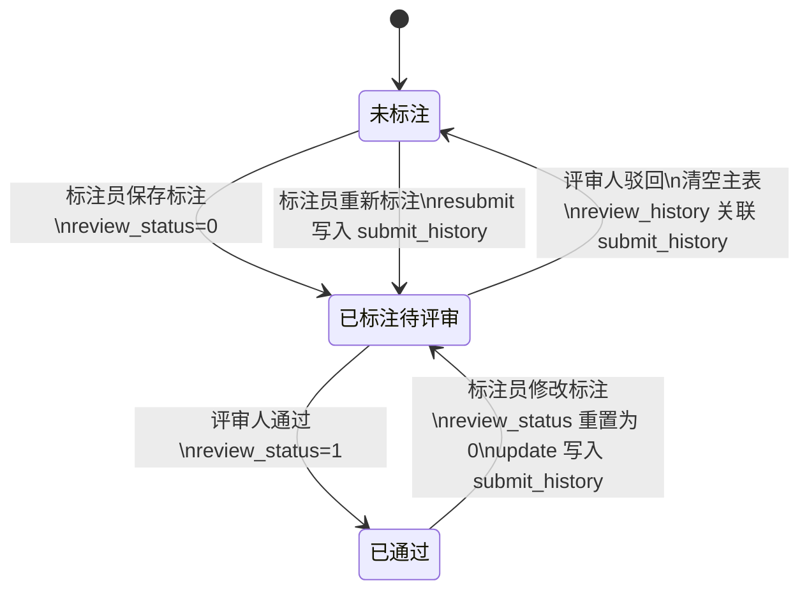

# AI 代码仓扫描结果管理平台 - 产品设计文档

本文档描述 **aiRepoScan** 全栈方案（Web 管理端、后端 API 服务、扫描执行、PostgreSQL 持久化、S3 结果存储），按「需求分析 → 整体作业流分析 → 具体功能实现 → DFX 分析 → 测试分析」组织，与 `设计文档模板.md` 写作规范对齐。

**关联文档**：[`接口文档.md`](接口文档.md)、[`专家评审方案.md`](专家评审方案.md)、[`README.md`](README.md)

---

## 1. 需求分析

### 1.1 项目概述

团队在代码仓执行 AI / 静态分析扫描后，会生成大量告警数据（文件、行号、规则、说明、代码片段）。原始 JSON 难以支撑任务化管理、多人协作标注与治理统计。

| 维度 | 说明 |
|------|------|
| **项目定位** | 产业代码仓扫描结果管理与标注平台，覆盖「任务编排 → 扫描执行 → 结果入库 → 人工标注 → 统计复盘」 |
| **核心目标** | 将分散告警转为可检索、可标注、可统计的数据资产，支撑质量治理闭环 |
| **系统组成** | Web 管理端、后端 REST 服务（`ai_repo_scan_service`）、扫描 Agent（本机/远程）、PostgreSQL、对象存储 S3 |
| **业务边界** | 平台负责任务与结果管理、标注协作与统计；扫描引擎以 Agent + 模型形式对接，不内置规则引擎 |

### 1.2 目标用户

| 角色 | 核心痛点 | 典型场景 | 期望价值 |
|------|----------|----------|----------|
| **任务负责人** | 扫描任务分散、进度不可见 | 创建任务、配置代码仓与扫描路径、启动扫描、上传/同步结果 | 以任务维度统一管理扫描与结果 |
| **标注人员** | 告警量大、定位成本高 | 按规则/状态筛选告警，提交标注结论与原因 | 低学习成本完成逐条判定 |
| **评审人员** | 需对初判结论做质量把关 | 在扫描结果列表中对已标注条目执行通过/驳回评审 | 形成可追溯的复核结论，驳回后标注员可重新标注 |
| **管理者** | 缺乏完成度与规则分布视图 | 查看任务完成率、标注状态分布、规则 Top N | 驱动缺陷治理与复盘 |

**核心业务流程**：创建任务 → 配置扫描参数（含 Agent URL、模型）→ 启动扫描 / 上传结果 → 任务完成 → 标注告警 → 统计看板复盘。

### 1.3 功能需求

#### 1.3.1 平台总览

| 功能点 | 用户 + 动作 + 结果 | 状态 |
|--------|-------------------|------|
| 汇总指标 | 用户进入总览 → 查看任务总数、进行中、已完成、扫描告警合计 | 已实现（Web 端聚合查询） |
| 任务状态分布 | 用户查看各状态任务占比图表 | 规划中（待平台级聚合 API） |
| 缺陷/标注全局统计 | 用户查看跨任务缺陷类型与标注状态分布 | 规划中 |
| 最近任务与趋势 | 快速跳转任务详情；按时间查看创建/缺陷趋势 | 规划中 |

#### 1.3.2 任务管理

| 功能点 | 设计说明 | 状态 |
|--------|----------|------|
| 任务视图 | 「全部任务 / 我的任务」（按 `creator` 筛选） | 已实现 |
| 筛选与分页 | 任务名称模糊搜索、任务状态筛选、分页 | 已实现 |
| 创建任务 | 必填任务名、产品名、代码仓 URL 等；写入 `t_repo_scan_task` | 已实现 |
| 编辑任务 | 更新仓库、分支、路径、Agent 配置、组织信息等 | 已实现 |
| 删除任务 | 仅创建人可删；**排队中、进行中**不可删；联动清理缓存与关联数据 | 已实现 |
| 启动扫描 | 校验 `host_url`、`model_name` 后触发扫描；更新任务状态与执行报告 | 已实现 |

#### 1.3.3 扫描结果与标注

| 功能点 | 设计说明 | 状态 |
|--------|----------|------|
| 结果存储 | 扫描产出 JSON 存 S3（`s3_path`）；明细不落 relational 表，查询时解析并与标注关联 | 已实现 |
| 结果查询 | 分页返回告警列表；支持按 `ruleName`、标注状态筛选 | 已实现 |
| 告警展示 | 文件、规则、行号、描述、代码片段与上下文 | 已实现 |
| 人工标注 | 三态结论（需要修改 / 无需修改 / 问题误报）+ 原因；写入 `t_repo_scan_annotation` | 已实现 |
| 标注权限 | 未标注任何人可首次提交；已标注仅**首次标注人**可修改或取消 | 已实现 |
| **标注评审** | 评审人对已标注条目给出**通过**或**驳回**；通过则展示「已通过」；驳回则清空当前标注；标注提交与评审分别写入 `t_annotation_submit_history`、`t_annotation_review_history` | 设计中（见 3.7） |
| 规则统计 | 按任务聚合规则命中数，写入/读取 `t_rule_statistics` | 已实现 |

#### 1.3.4 统计看板（任务维度）

| 统计项 | 数据来源 | 状态 |
|--------|----------|------|
| 总缺陷数 | S3 结果条数或 `warn_count` | 已实现 |
| 标注完成度 | `t_repo_scan_annotation` 与告警总数对比 | 已实现 |
| 标注状态分布 | 按 `issue_result` 聚合 | 已实现 |
| 规则分布 Top N | `t_rule_statistics` 或实时聚合 | 已实现 |

#### 1.3.5 扩展功能（后续迭代）

| 功能 | 说明 | 状态 |
|------|------|------|
| 标注评审（细化） | 双历史表：标注提交历史 + 评审历史；驳回后重标全程可追溯 | 已纳入本文档 3.7；与 [`专家评审方案.md`](专家评审方案.md) 对齐 |
| 统一登录鉴权 | SSO / 网关注入用户身份 | 待接入 |
| 平台级聚合 API | 总览图表、趋势由后端一次返回 | 待开发 |

### 1.4 非功能需求

| 类别 | 需求描述 | 验收口径 |
|------|----------|----------|
| **性能** | 单任务告警可达数千条 | 扫描结果服务端分页；规则统计预聚合 |
| **可用性** | 创建、启动、标注等关键操作反馈明确 | 前后端统一错误码与提示 |
| **安全与权限** | 删除、标注修改受身份与业务规则约束 | 后端鉴权为准，前端做体验层拦截 |
| **可靠性** | 扫描失败可追踪、可重试 | `t_scan_task_report` 记录进度与错误 |
| **可扩展性** | 扫描 Agent、模型、规则可替换 | 任务表保留 `host_url`、`model_name`、`commit_id` |

---

## 2. 整体作业流分析

### 2.1 系统架构



**分层职责**：

| 层级 | 职责 |
|------|------|
| **Web 管理端** | 任务 CRUD、启动扫描、结果浏览与标注、统计可视化；调用 REST API |
| **后端 API 服务** | 任务生命周期、S3 结果读写、标注持久化、规则/标注统计、权限校验 |
| **扫描 Agent** | 接收启动指令，拉取代码仓，调用模型/规则，产出 JSON 并上传 S3，回写执行报告 |
| **PostgreSQL** | 任务元数据、标注记录、规则统计、扫描执行报告 |
| **S3** | 扫描结果 JSON（告警明细主体，按 `warn_uuid` 标识） |

### 2.2 用例视图



### 2.3 核心时序：任务创建到标注



### 2.3.1 标注评审时序



### 2.4 任务状态机

| 状态 | 含义 | 系统行为 |
|------|------|----------|
| 未开始 | 任务已创建 | 可编辑；可启动扫描 |
| 排队中 | 已提交启动，等待 Agent | 不可重复启动；不可删除 |
| 进行中 | Agent 执行中 | 写 `t_scan_task_report.progress`；不可删除 |
| 已完成 | 结果已就绪 | 开放结果查询与标注；可重新扫描 |
| 失败 | 扫描异常 | `error_messages` 记录原因；可修正后重启 |

---

## 3. 具体功能实现

### 3.1 逻辑视图：数据与存储分工

| 数据类型 | 存储位置 | 说明 |
|----------|----------|------|
| 任务元数据 | `t_repo_scan_task` | 仓库、分支、状态、S3 路径、告警总数等 |
| 扫描执行过程 | `t_scan_task_report` | 进度、起止时间、发现告警数、错误信息 |
| 告警明细 | **S3 JSON** | 以 `warn_uuid` 为键；含文件、规则、代码片段等 |
| 人工标注（当前态） | `t_repo_scan_annotation` | 与 `warn_uuid` + `task_id` 关联；含当前评审状态 |
| 标注提交历史 | `t_annotation_submit_history` | 每次标注提交/修改/取消/驳回后重标的完整记录 |
| 标注评审历史 | `t_annotation_review_history` | 每次评审通过/驳回记录；通过 `submit_history_id` 关联被评审的标注提交 |
| 规则统计 | `t_rule_statistics` | 任务维度规则命中缓存，供看板加速 |

查询扫描结果时：从 S3 读取 JSON → 按页切片 → LEFT JOIN `t_repo_scan_annotation` 填充 `annotation` 字段。

### 3.2 数据库设计

**Schema**：`ai_code_repo_scan`（PostgreSQL）

#### 3.2.1 扫描任务表 `t_repo_scan_task`

| 字段 | 类型 | 约束/默认 | 说明 |
|------|------|-----------|------|
| `task_id` | varchar(225) | PK, NOT NULL | 任务 ID |
| `task_name` | varchar(100) | NOT NULL | 任务名称 |
| `branch` | varchar(100) | | 扫描分支 |
| `path_list` | text | | 扫描路径（逗号分隔） |
| `s3_path` | varchar(225) | | 扫描结果 JSON 在 S3 的路径 |
| `creator` | varchar(50) | | 创建人短工号 |
| `creator_name` | varchar(16) | | 创建人中文名 |
| `create_time` | timestamp(6) | DEFAULT pg_systimestamp() | 创建时间 |
| `task_status` | varchar(20) | | 未开始/排队中/进行中/已完成/失败 |
| `repo_url` | varchar(255) | | 代码仓地址 |
| `assistant_versions` | varchar(255) | | 扫描助手版本（逗号分隔） |
| `product_name` | varchar(100) | | 产品名称 |
| `code_language` | varchar(50) | | 代码语言 |
| `line_num` | numeric(10,1) | | 扫描代码量（k） |
| `dept_name` | varchar(100) | | 部门 |
| `pdu_name` | varchar(100) | | PDU |
| `warn_count` | numeric(8,0) | | 告警总数（扫描完成后汇总） |
| `host_url` | varchar(255) | | 本机/远程扫描 Agent URL |
| `model_name` | varchar(255) | | 扫描模型名称 |
| `commit_id` | varchar(255) | | 扫描对应代码提交 ID |

#### 3.2.2 标注表 `t_repo_scan_annotation`

| 字段 | 类型 | 约束/默认 | 说明 |
|------|------|-----------|------|
| `id` | int8 | PK, 序列 | 标注记录 ID |
| `warn_uuid` | varchar(36) | NOT NULL | 告警 UUID（关联 S3 结果） |
| `task_id` | varchar(225) | | 所属任务 |
| `user_id` | varchar(50) | NOT NULL | 标注人短工号 |
| `user_name` | varchar(100) | | 标注人姓名 |
| `user_department` | varchar(100) | | 标注人部门 |
| `issue_result` | int2 | NOT NULL | 0 需要修改 / 1 无需修改 / 2 问题误报 |
| `reason` | text | | 标注原因 |
| `annotation_status` | int2 | NOT NULL, DEFAULT 1 | 1 已标注；驳回重置后为 0 或记录删除 |
| `review_status` | int2 | | 0 待评审 / 1 已通过（驳回后主表清空，不保留「已驳回」态，历史见评审历史表） |
| `reviewer_user_id` | varchar(50) | | 最近一次评审人短工号（通过时写入） |
| `review_time` | timestamp(6) | | 最近一次评审时间（通过时写入） |
| `create_time` | timestamp(6) | NOT NULL, DEFAULT pg_systimestamp() | 创建时间 |
| `update_time` | timestamp(6) | NOT NULL, DEFAULT pg_systimestamp() | 更新时间 |

**业务规则**：同一 `(task_id, warn_uuid)` 仅保留一条有效标注；修改/取消需校验首次标注人。标注保存成功后 `review_status` 置为 `0`（待评审），并**同步 INSERT** `t_annotation_submit_history`。

#### 3.2.2.1 标注提交历史表 `t_annotation_submit_history`

专门记录标注员每一次提交、修改、取消及驳回后的重新标注，与评审历史分离，支撑完整审计时间线。

| 字段 | 类型 | 约束/默认 | 说明 |
|------|------|-----------|------|
| `id` | int8 | PK, 序列 | 主键 |
| `task_id` | varchar(225) | NOT NULL | 所属任务 |
| `warn_uuid` | varchar(36) | NOT NULL | 告警 UUID |
| `annotation_id` | int8 | | 关联标注主表 ID（主表删除后仍可追溯） |
| `action` | varchar(20) | NOT NULL | `submit` 首次提交 / `update` 修改 / `resubmit` 驳回后重标 / `cancel` 取消标注 |
| `round_no` | int4 | NOT NULL, DEFAULT 1 | 标注轮次；驳回后重标时递增 |
| `user_id` | varchar(50) | NOT NULL | 标注人短工号 |
| `user_name` | varchar(100) | | 标注人姓名 |
| `user_department` | varchar(100) | | 标注人部门 |
| `issue_result` | int2 | | 提交时的标注结论（0/1/2）；`cancel` 时为空 |
| `reason` | text | | 提交时的标注原因 |
| `submit_time` | timestamp(6) | NOT NULL, DEFAULT pg_systimestamp() | 提交时间 |

**索引建议**：`(task_id, warn_uuid)`、`(task_id, warn_uuid, submit_time DESC)`，按告警查提交链路与时间线合并。

**写入规则**：

- **首次标注**（`POST /api/annotations`，主表无记录）：INSERT，`action=submit`，`round_no=1`。
- **修改标注**（主表已有记录）：INSERT，`action=update`，`round_no` 不变。
- **驳回后重标**（主表已清空或等效未标注）：INSERT，`action=resubmit`，`round_no` 在上次被驳回的提交轮次基础上 +1。
- **取消标注**（`issueResult=null`）：INSERT，`action=cancel`，`issue_result`、`reason` 为空。

#### 3.2.2.2 标注评审历史表 `t_annotation_review_history`

仅记录评审人的**通过/驳回**操作；被评审的标注内容通过 `submit_history_id` 关联至提交历史表，不在本表冗余快照。

| 字段 | 类型 | 约束/默认 | 说明 |
|------|------|-----------|------|
| `id` | int8 | PK, 序列 | 主键 |
| `task_id` | varchar(225) | NOT NULL | 所属任务 |
| `warn_uuid` | varchar(36) | NOT NULL | 告警 UUID |
| `submit_history_id` | int8 | NOT NULL | 关联 `t_annotation_submit_history.id`，指向本次评审所针对的标注提交 |
| `annotation_id` | int8 | | 冗余关联标注主表 ID |
| `action` | varchar(20) | NOT NULL | `approve` 通过 / `reject` 驳回 |
| `reviewer_user_id` | varchar(50) | NOT NULL | 评审人短工号 |
| `reviewer_user_name` | varchar(100) | | 评审人姓名 |
| `review_time` | timestamp(6) | NOT NULL, DEFAULT pg_systimestamp() | 评审时间 |
| `reject_reason` | text | | 驳回理由；`action=reject` 时**必填** |

**索引建议**：`(task_id, warn_uuid)`、`(submit_history_id)`、`(task_id, review_time DESC)`。

**写入规则**：

- **通过**：INSERT 评审记录，`action=approve`，`submit_history_id` 指向当前待评审的最新 submit 记录；更新主表 `review_status=1` 及 `reviewer_user_id`、`review_time`。
- **驳回**：INSERT 评审记录，`action=reject`，`reject_reason` 必填，`submit_history_id` 指向被驳回的 submit 记录；再将主表标注清空（标注内容已在 submit_history 中保留，无需在本表快照）。

#### 3.2.3 规则统计表 `t_rule_statistics`

| 字段 | 类型 | 约束/默认 | 说明 |
|------|------|-----------|------|
| `id` | int4 | PK, 序列 | 主键 |
| `task_id` | varchar(255) | | 任务 ID |
| `rule_name` | varchar(255) | | 规则名称 |
| `rule_count` | int4 | | 该规则命中告警数 |
| `update_time` | timestamp(6) | | 统计更新时间 |

扫描完成或结果文件更新后，由后端解析 S3 JSON 聚合写入/刷新本表。

#### 3.2.4 扫描执行报告表 `t_scan_task_report`

| 字段 | 类型 | 约束/默认 | 说明 |
|------|------|-----------|------|
| `task_id` | varchar(255) | PK, NOT NULL | 任务 ID（与任务 1:1） |
| `commit_id` | varchar(255) | | 本次扫描 commit |
| `updater` | varchar(255) | | 进度更新来源（Agent/系统） |
| `progress` | varchar(255) | | 执行进度描述 |
| `found_warnings` | int4 | | 已发现告警数（执行中增量） |
| `start_time` | timestamp(6) | | 扫描开始时间 |
| `finish_time` | timestamp(6) | | 扫描结束时间 |
| `error_messages` | text | | 失败时的错误信息 |

#### 3.2.5 实体关系



**说明**：告警明细存于 S3，通过 `warn_uuid` 与 `t_repo_scan_annotation` 逻辑关联，无独立告警 relational 表。

### 3.3 接口设计

**服务前缀**：`{base}/ai_repo_scan_service`  
**统一响应**：`{ data, meta }`，成功时 `meta.isSuccess = true`。  
**详细契约**：见 [`接口文档.md`](接口文档.md)。

| 能力 | 方法与路径 | 主要持久化 |
|------|------------|------------|
| 查询任务列表 | `GET /api/tasks` | `t_repo_scan_task` |
| 查询任务信息 | `GET /api/tasks/{taskId}/info` | `t_repo_scan_task` |
| 查询扫描结果 | `GET /api/tasks/{taskId}/scan-results` | S3 + `t_repo_scan_annotation` |
| 创建任务 | `POST /api/tasks` | `t_repo_scan_task` |
| 更新任务 | `PUT /api/tasks/{taskId}` | `t_repo_scan_task` |
| 删除任务 | `DELETE /api/tasks/{taskId}` | 任务表及关联数据 |
| 启动扫描 | `POST /api/tasks/{taskId}/start` | 任务状态 + `t_scan_task_report` |
| 上传结果文件 | `POST /api/tasks/{taskId}/uploadDataSet` | S3 + 更新 `s3_path` |
| 标注统计 | `GET /api/tasks/{taskId}/annotation-statistics` | 标注表 + 规则统计表 |
| 保存标注 | `POST /api/annotations` | `t_repo_scan_annotation` + `t_annotation_submit_history` |
| 标注评审 | `POST /api/annotations/review` | 标注表 + `t_annotation_review_history` |
| 标注提交历史 | `GET /api/tasks/{taskId}/annotations/{warnUuid}/submit-history` | `t_annotation_submit_history` |
| 评审历史查询 | `GET /api/tasks/{taskId}/annotations/{warnUuid}/review-history` | `t_annotation_review_history` |
| 操作时间线 | `GET /api/tasks/{taskId}/annotations/{warnUuid}/timeline` | 提交历史 + 评审历史合并 |

**关键约定**：

- 扫描结果 query：`pageNum`、`pageSize` 必填；可选 `ruleName`、`annotation`（`unmarked` / `0` / `1` / `2`）、`reviewStatus`（`0` / `1`）。
- 保存标注：`issueResult = null` 表示取消标注，同步写入 submit_history（`action=cancel`）；成功保存后 `reviewStatus` 重置为 `0`（待评审），并写入 submit_history（`submit` / `update` / `resubmit`）。
- 标注评审：仅对「已标注且待评审」（`reviewStatus=0`）的条目可操作；驳回时 `comment`（驳回理由）必填；评审记录通过 `submitHistoryId` 关联最近一次待评审的提交记录。
- API 字段命名：数据库 snake_case ↔ 接口 camelCase（如 `creator_name` → `nameCn`）。

### 3.4 标注结果枚举

| `issue_result` | 含义 |
|----------------|------|
| 未写入 / 已删除 | 未标注 |
| `0` | 需要修改 |
| `1` | 无需修改 |
| `2` | 问题误报 |

统计接口 `annotationDistribution.resultCode` 与 `issue_result` 映射见 [`接口文档.md`](接口文档.md) 附录 A。

#### 3.4.1 评审状态枚举 `review_status`

| 值 | 含义 | 列表展示 |
|----|------|----------|
| 未写入 / 已清空 | 未标注或驳回后已重置 | 无评审标签 |
| `0` | 待评审 | 灰色「待评审」 |
| `1` | 已通过 | 绿色「已通过」 |

> 驳回后不保留主表 `review_status=2`；被驳回的标注内容见 `t_annotation_submit_history`，驳回操作见 `t_annotation_review_history`；当前告警回到未标注，标注员重标后再次进入 `review_status=0`。

### 3.5 技术选型

| 层级 | 选型 | 用途 |
|------|------|------|
| Web 管理端 | Vue 3 + Vue Router + Pinia | 任务与标注交互界面 |
| Web UI | Element Plus + ECharts | 组件与规则分布图表 |
| Web 构建 | Vite | 前端工程化 |
| 后端 | REST 服务（`ai_repo_scan_service`） | 任务、结果、标注、统计 API |
| 数据库 | PostgreSQL（schema `ai_code_repo_scan`） | 任务、标注、统计、执行报告 |
| 对象存储 | S3 | 扫描结果 JSON |
| 扫描运行时 | Agent + 模型（`host_url` / `model_name`） | 实际扫描执行 |

### 3.6 Web 管理端实现要点（子模块）

当前代码仓 `aiRepoScan-hw` 为 Web 管理端实现，与后端通过 REST 对接：

| 模块 | 说明 |
|------|------|
| 路由 | `/overview` 总览、`/tasks` 任务列表、`/task/:id` 任务详情 |
| API 门面 | `taskManagementApi` 统一封装；支持 `mock` / `live` 切换便于联调 |
| 页面 | 总览（汇总卡片已实现，图表占位）、任务列表、任务详情（信息 Tab + 标注 Tab + 统计看板） |
| 标注评审 | 扫描结果列表行内/批量评审入口；评审状态筛选与标签；驳回弹窗（理由必填） | 待开发 |

本地开发可将 `apiMode` 设为 `mock` 或使用 `VITE_API_REPO_SCAN` 指向后端服务。

### 3.7 标注评审功能设计

本节细化「扫描结果列表缺陷标注评审」的完整方案，采用**方案 B：双历史表分离**——标注提交与评审操作分表存储，通过 `submit_history_id` 关联，支撑「驳回 → 重标 → 再评审」全链路追溯。

#### 3.7.1 业务目标

| 目标 | 说明 |
|------|------|
| 质量复核 | 标注员初判后，由评审人对结论进行二次确认，避免误标漏标进入治理统计。 |
| 结论二元化 | 评审结果仅两种：**通过**、**驳回**；通过即视为当前有效结论已确认。 |
| 驳回可重标 | 驳回后当前标注结论与原因对用户清空，标注员可重新标注并再次进入待评审。 |
| 全程可追溯 | **标注侧**：每次提交/修改/取消/重标写入 `t_annotation_submit_history`；**评审侧**：每次通过/驳回写入 `t_annotation_review_history` 并关联对应提交记录。 |

#### 3.7.1.1 双历史表职责

| 表 | 职责 | 典型记录 |
|----|------|----------|
| `t_annotation_submit_history` | 标注员操作历史 | 首次标注、修改、取消、驳回后重标 |
| `t_annotation_review_history` | 评审人操作历史 | 通过、驳回（含驳回理由、评审人工号、评审时间） |

两表通过 `submit_history_id` 关联：每条评审记录指向**被评审的那次标注提交**；完整时间线由 timeline 接口按时间合并两表返回。

#### 3.7.2 状态流转



#### 3.7.2.1 完整追溯示例（驳回后重标）

| 顺序 | 事件 | submit_history | review_history |
|------|------|----------------|----------------|
| 1 | 标注员提交「需要修改 + 原因 A」 | `action=submit`, round_no=1 | — |
| 2 | 评审驳回，理由「结论不对」 | — | `action=reject`, 关联 #1, reject_reason |
| 3 | 标注员重标「无需修改 + 原因 B」 | `action=resubmit`, round_no=2 | — |
| 4 | 评审通过 | — | `action=approve`, 关联 #3 |

timeline 接口按时间合并上述 4 条记录，即可还原完整过程。

**与标注修改的联动**：

- 标注员在「待评审」或「已通过」状态下修改标注：主表 UPSERT + INSERT submit_history（`action=update`）；`review_status` 重置为 `0`，需重新评审。
- 标注员取消标注（`issueResult=null`）：主表删除或失效 + INSERT submit_history（`action=cancel`）；若存在待评审/已通过态，同步清理主表评审字段。

#### 3.7.3 标注提交与评审规则

| 操作 | 主表 | submit_history | review_history | 前端展示 |
|------|------|----------------|----------------|----------|
| **首次/修改/重标** | UPSERT 标注；`review_status=0` | INSERT：`submit` / `update` / `resubmit` | — | 展示标注结论 +「待评审」 |
| **取消标注** | 删除或清空 | INSERT：`cancel` | — | 「未标注」 |
| **评审通过** | `review_status=1`；写入评审人、时间 | — | INSERT：`approve`，`submit_history_id` 指向当前待评审提交 | 「已通过」 |
| **评审驳回** | 清空标注，回到未标注 | — | INSERT：`reject`，`reject_reason` 必填，关联被驳回的 submit 记录 | 「未标注」；timeline 可查看被驳回的原标注 |

**前置校验**：

- 仅 `review_status=0` 且已存在有效标注时可评审；`submit_history_id` 取该告警下**最近一条** `action` 为 `submit` / `update` / `resubmit` 且尚未被评审通过的记录。
- 评审人需具备评审权限（角色「评审人」或任务级指派，见 DFX 4.4）。
- 驳回时 `comment` / `reject_reason` 非空，否则 400。

#### 3.7.4 接口契约

**POST** `/api/annotations`（扩展）

保存标注时除更新主表外，**必须**写入 `t_annotation_submit_history`；响应可返回 `submitHistoryId` 供调试。

**POST** `/api/annotations/review`

请求体：

```json
{
  "taskId": "Tba19e29a-52c2-404f-aaba-c9e70ca3bcd3",
  "warnUuid": "6bc8163a-3d2d-4d58-a70b-f07775295c1a",
  "decision": "approve",
  "comment": "结论合理"
}
```

| 字段 | 类型 | 必填 | 说明 |
|------|------|------|------|
| `taskId` | string | 是 | 任务 ID |
| `warnUuid` | string | 是 | 告警 UUID |
| `decision` | string | 是 | `approve` 通过 / `reject` 驳回 |
| `comment` | string | 驳回必填 | 评审意见；驳回时为**驳回理由** |

响应：更新后的 `annotation` 对象（通过时含 `reviewStatus=1`；驳回时 `annotation=null` 表示未标注）。

**GET** `/api/tasks/{taskId}/annotations/{warnUuid}/submit-history`

返回该告警全部标注提交记录，按 `submit_time` 降序；含 `action`、`roundNo`、`issueResult`、`reason`、标注人信息。

**GET** `/api/tasks/{taskId}/annotations/{warnUuid}/review-history`

返回该告警全部评审记录，按 `review_time` 降序；含 `action`、`rejectReason`、评审人信息、`submitHistoryId`（可 JOIN 展开被评审的标注内容）。

**GET** `/api/tasks/{taskId}/annotations/{warnUuid}/timeline`（推荐）

合并 submit-history 与 review-history，按时间升序返回统一事件流，供前端「操作记录」时间线展示：

```json
{
  "events": [
    { "type": "submit", "time": "...", "action": "submit", "issueResult": 0, "reason": "...", "userId": "..." },
    { "type": "review", "time": "...", "action": "reject", "rejectReason": "结论不对", "reviewerUserId": "...", "submitHistoryId": 1 },
    { "type": "submit", "time": "...", "action": "resubmit", "issueResult": 1, "reason": "...", "roundNo": 2 },
    { "type": "review", "time": "...", "action": "approve", "reviewerUserId": "...", "submitHistoryId": 2 }
  ]
}
```

**扫描结果列表扩展字段**（`annotation` 嵌套对象）：

| 字段 | 说明 |
|------|------|
| `reviewStatus` | 0 待评审 / 1 已通过 |
| `reviewerUserId` | 通过时的评审人工号 |
| `reviewTime` | 通过时的评审时间 |

**统计接口扩展**（`GET .../annotation-statistics`）：

| 字段 | 说明 |
|------|------|
| `pendingReviewCount` | 待评审条数（`review_status=0`） |
| `approvedReviewCount` | 已通过条数（`review_status=1`） |
| `rejectedReviewCount` | 累计驳回次数（自 `t_annotation_review_history` 中 `action=reject` 计数，非当前态） |

#### 3.7.5 Web 管理端交互

1. **列表列**：在现有标注结论旁增加评审状态 Tag（待评审 / 已通过）。
2. **筛选**：评审状态下拉（全部 / 待评审 / 已通过），映射 `reviewStatus` 查询参数；评审人常用「待评审」快捷筛选。
3. **操作区**：具备评审权限的用户在「待评审」行展示「通过」「驳回」按钮。
4. **驳回弹窗**：多行文本输入驳回理由，校验非空后提交。
5. **通过**：可一键确认或轻量二次确认；成功后行内刷新为「已通过」。
6. **历史**：行展开「操作记录」调用 timeline 接口，按时间展示标注提交与评审事件；驳回记录通过 `submitHistoryId` 关联展示被驳回的原标注内容。
7. **权限**：无评审权限用户仅只读查看评审状态，不展示操作按钮。

#### 3.7.6 与统计口径的关系

- **标注完成度**：仍按是否存在有效标注（`issue_result` 非空）统计。
- **评审完成度**：已通过数 / 已标注数；待评审数单独展示。
- **治理终态**：对外导出或复盘时，建议仅统计 `review_status=1` 的条目为「已确认结论」。

---

## 4. DFX 分析

### 4.1 性能

| 问题 | 场景 | 影响 | 解决方案 | 状态 |
|------|------|------|----------|------|
| 大结果集查询 | 单任务 1000+ 告警 | API 慢、传输大 | S3 结果服务端分页；按需 JOIN 标注 | 已解决 |
| 规则统计重复计算 | 频繁打开看板 | DB/CPU 压力 | `t_rule_statistics` 预聚合 | 已解决 |
| 平台总览聚合 | 任务量大 | 多次列表查询 | 新增 overview 汇总 API | 规划中 |

### 4.2 可靠性

| 问题 | 场景 | 影响 | 解决方案 | 状态 |
|------|------|------|----------|------|
| 扫描中途失败 | Agent 异常 | 任务悬挂 | `t_scan_task_report.error_messages` + 状态「失败」 | 已设计 |
| S3 与 DB 不一致 | 上传失败 | 结果不可读 | 上传成功后再更新 `s3_path`、`warn_count` | 已实现 |
| 标注并发 | 多人改同一告警 | 结论覆盖 | 首次标注人锁定；DB 唯一约束 + 403 | 已实现 |
| 评审与标注竞态 | 评审驳回同时标注员修改 | 状态不一致 | 评审 API 乐观锁（`update_time` 或 `review_status` 条件更新）；冲突返回 409 | 设计中 |

### 4.3 可维护性

| 问题 | 场景 | 影响 | 解决方案 | 状态 |
|------|------|------|----------|------|
| 结果 JSON 结构演进 | 扫描引擎升级 | 解析失败 | 版本字段 + 后端兼容层 | 进行中 |
| 接口与表字段映射 | 前后端协作 | 联调成本 | 统一接口文档；camelCase/snake_case 转换层 | 进行中 |

### 4.4 安全

| 问题 | 场景 | 影响 | 解决方案 | 状态 |
|------|------|------|----------|------|
| 身份鉴权 | 生产环境 | 越权 | SSO + API 层校验 creator / 标注人 / 评审人 | 待接入 |
| 评审权限 | 非评审人误操作 | 错误重置标注 | 仅 `review_status=0` 可评审；评审接口校验评审角色；驳回写 review_history 后再清空主表 | 设计中 |
| S3 路径泄露 | 恶意访问 | 数据泄露 | 预签名 URL 或网关代理下载 | 待加固 |

### 4.5 可扩展性

| 问题 | 场景 | 影响 | 解决方案 | 状态 |
|------|------|------|----------|------|
| 标注评审 | 标注需复核 | 流程不完整 | 见 3.7：双历史表分离；驳回清空主表、提交/评审分表入库 | 设计中 |
| 多 commit 扫描 | 同任务多次扫描 | 结果覆盖 | `commit_id` + 报告表记录历次执行 | 字段已预留 |

### 4.6 DFX 评分（当前）

| 维度 | 权重 | 得分 | 说明 |
|------|------|------|------|
| D - 可开发性 | 30 | 28 | 表结构清晰，S3+PG 分工明确；overview API 待补 |
| F - 功能可用性 | 40 | 34 | 任务→扫描→标注→统计主链路完整；平台总览图表待完善 |
| X - 可扩展与可运维 | 30 | 26 | 执行报告表、commit_id 支持运维追踪；SSO 与监控待补齐 |
| **总分** | **100** | **88** | 数据库与核心 API 已落地，平台级聚合与鉴权完成后可验收 |

---

## 5. 测试分析

### 5.1 场景功能测试

| 类型 | 测试类别 | 测试场景 | 前置条件 | 测试步骤 | 检查点 |
|------|----------|----------|----------|----------|--------|
| 正常 | 功能 | 创建任务 | 用户已登录 | POST 创建任务 → 查 PG | `t_repo_scan_task` 新增行，状态「未开始」 |
| 异常 | 功能 | 创建任务校验 | — | 缺 task_name / product_name | 400，无入库 |
| 正常 | 功能 | 启动扫描 | host_url、model_name 已填 | POST start → Agent 执行 | 状态→排队中/进行中；`t_scan_task_report` 有记录 |
| 异常 | 功能 | 重复启动 | 任务排队中或进行中 | 再次 start | 400，状态不变 |
| 正常 | 功能 | 扫描完成 | Agent 正常结束 | 结果上传 S3 | `task_status=已完成`，`warn_count`、`s3_path` 正确 |
| 异常 | 功能 | 扫描失败 | Agent 报错 | 查看报告 | `task_status=失败`，`error_messages` 有内容 |
| 正常 | 功能 | 上传结果文件 | 任务存在 | POST uploadDataSet | S3 有文件，`s3_path` 更新 |
| 正常 | 功能 | 分页查结果 | 任务已完成 | GET scan-results?pageNum=1 | 返回条数 ≤ pageSize，含 annotation |
| 正常 | 功能 | 保存标注 | 任务有告警 | POST annotations | 主表正确写入；submit_history 新增 `submit` 记录 |
| 正常 | 功能 | 修改标注 | 本人已标注 | POST annotations | submit_history 新增 `update`；review_status 重置为 0 |
| 权限 | 安全 | 他人标注 | 告警已被他人标注 | 其他用户修改 | 403 |
| 正常 | 功能 | 取消标注 | 本人已标注 | issueResult=null | 主表删除或失效；submit_history 新增 `cancel` |
| 正常 | 功能 | 标注统计 | 多种 issue_result | GET annotation-statistics | 完成率、分布与 DB 一致 |
| 正常 | 功能 | 评审通过 | 条目已标注且 review_status=0 | POST review decision=approve | 主表 review_status=1；review_history 关联 submit_history_id |
| 正常 | 功能 | 评审驳回 | 条目待评审 | POST review decision=reject + comment | 主表标注已清空；review_history 含 reject_reason；原标注仍在 submit_history |
| 异常 | 功能 | 重复评审 | 已通过或已清空 | 再次 review | 400/409，主表状态不变 |
| 正常 | 功能 | 驳回后重标 | 驳回后主表已清空 | 标注员再次 POST annotations | submit_history 新增 `resubmit`、round_no 递增 |
| 正常 | 功能 | 操作时间线 | 经历标注→驳回→重标→通过 | GET timeline | 事件按时间升序完整还原 |
| 正常 | 功能 | 规则统计 | 扫描完成 | 查 t_rule_statistics | 与 S3 结果规则聚合一致 |
| 权限 | 安全 | 删除任务 | 非创建人 | DELETE | 403 或业务拒绝 |
| 权限 | 安全 | 删进行中任务 | 创建人，状态进行中 | DELETE | 拒绝删除 |
| 边界 | 功能 | 零告警任务 | warn_count=0 | 打开标注页 | 空态，非 500 |
| 正常 | E2E | 端到端闭环 | 全链路环境就绪 | 创建→启动→标注→统计 | 各层数据一致 |

### 5.2 建议测试分层

| 层级 | 范围 |
|------|------|
| 单元 | 结果 JSON 解析、标注权限、状态机转换、统计聚合、round_no 递增与 timeline 合并 |
| 集成 | API ↔ PostgreSQL ↔ S3；启动扫描与报告回写 |
| E2E | Web 创建任务 → 标注 → 看板；与后端 live 环境联调 |

---

*文档版本：全栈视角；标注评审采用方案 B（`t_annotation_submit_history` + `t_annotation_review_history`）；数据库表结构以 PostgreSQL schema `ai_code_repo_scan` 为准。*
