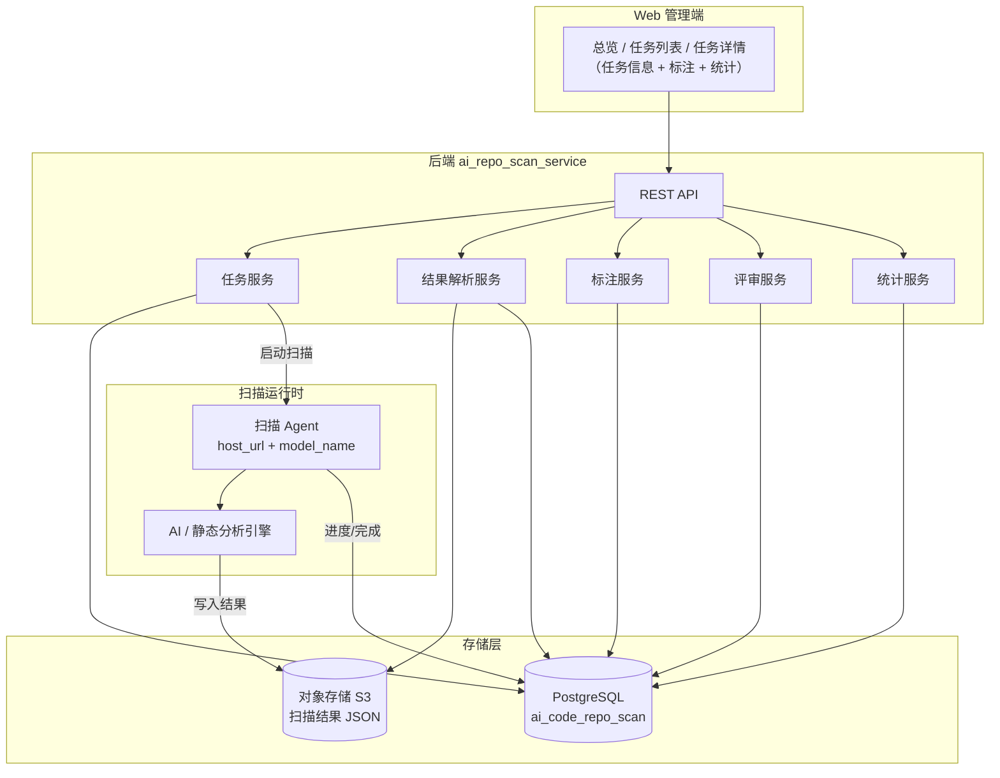
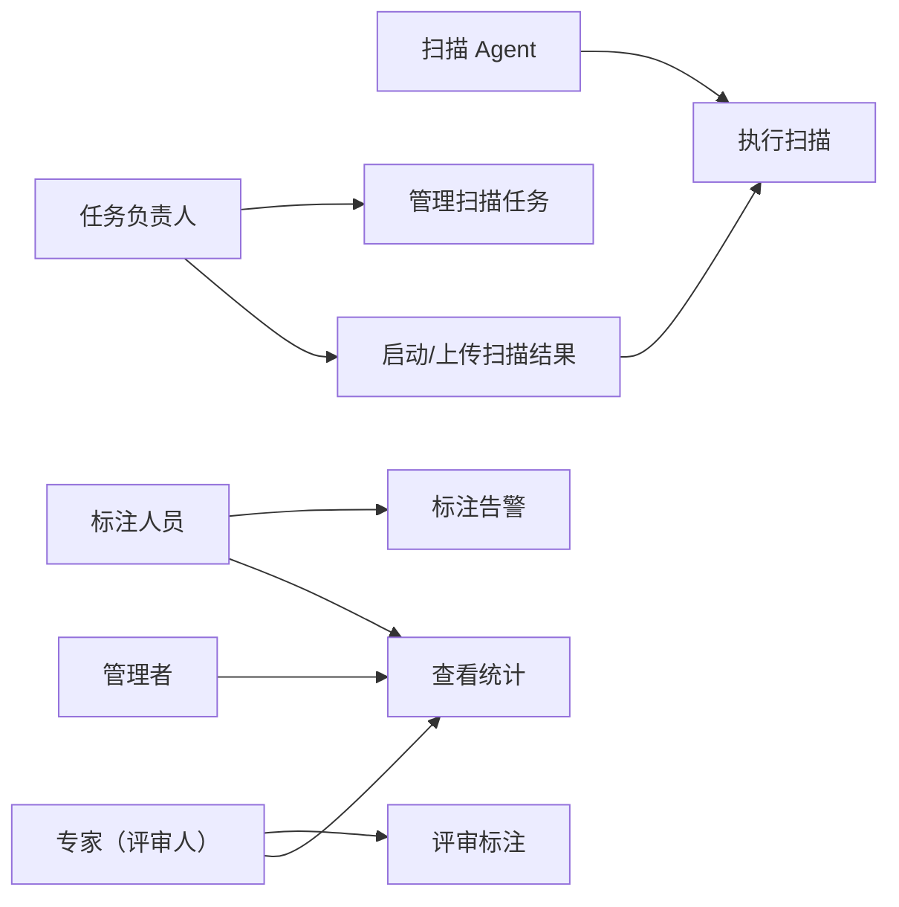
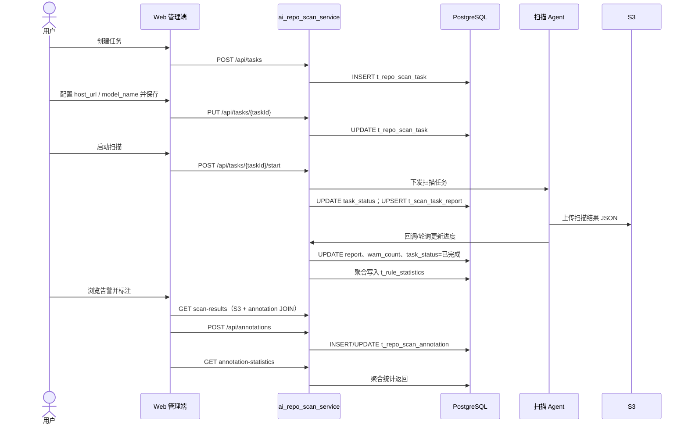
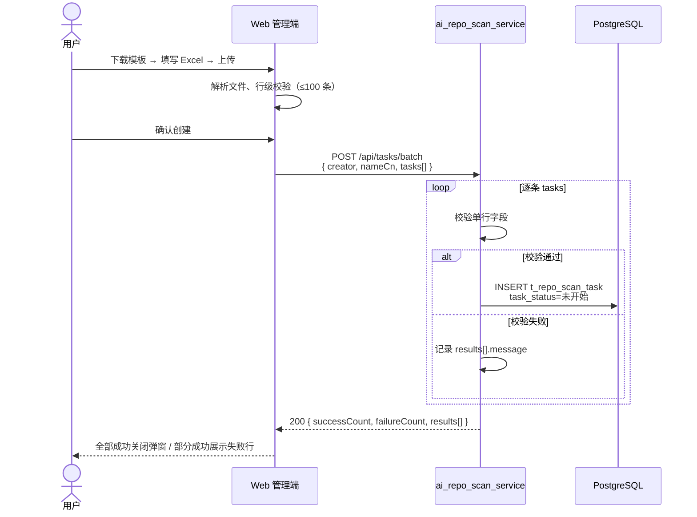
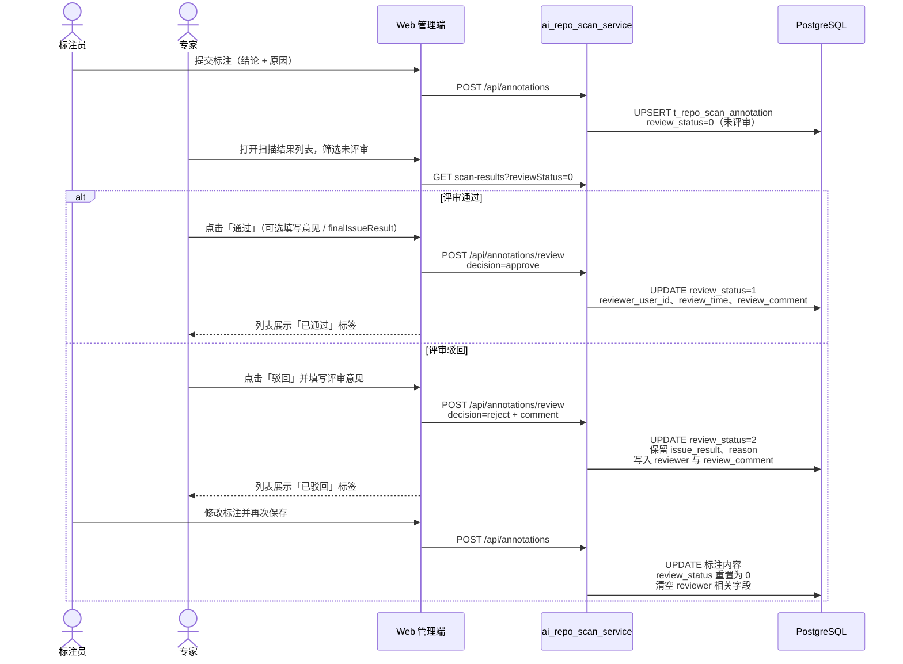
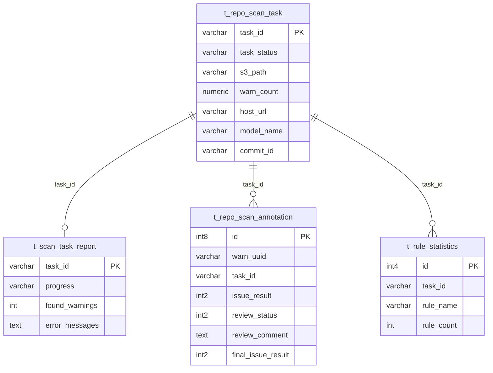
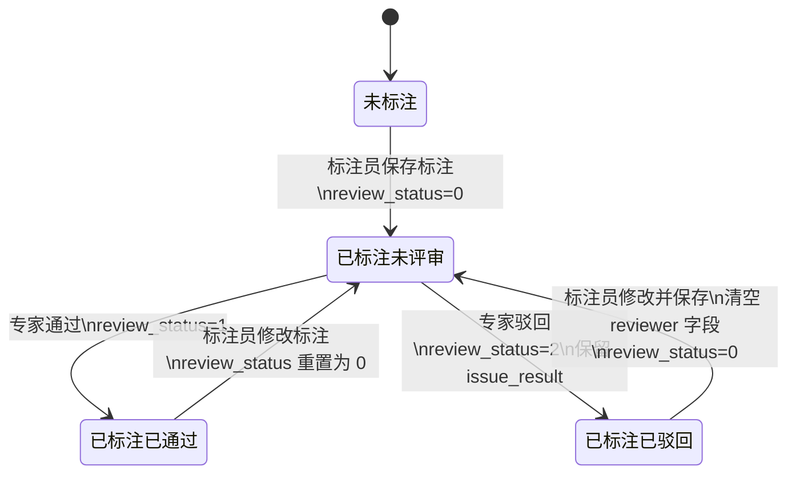
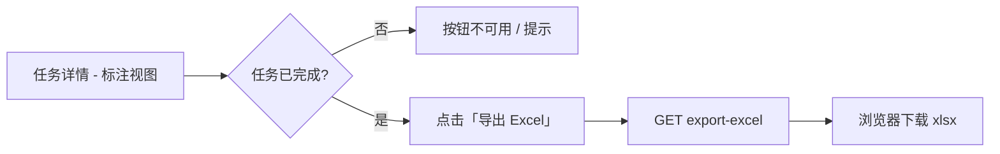
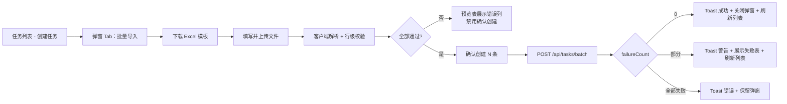

# AI 代码仓扫描结果管理平台 - 产品设计文档

本文档描述 **aiRepoScan** 全栈方案（Web 管理端、后端 API 服务、扫描执行、PostgreSQL 持久化、S3 结果存储），按「需求分析 → 整体作业流分析 → 具体功能实现 → DFX 分析 → 测试分析」组织，与 `设计文档模板.md` 写作规范对齐。

**关联文档**：[`接口文档.md`](接口文档.md)、[`专家评审方案.md`](专家评审方案.md)、[`README.md`](README.md)

---

## 1. 需求分析

### 1.1 项目概述

团队在代码仓执行 AI / 静态分析扫描后，会生成大量告警数据（文件、行号、规则、说明、代码片段）。原始 JSON 难以支撑任务化管理、多人协作标注与治理统计。

| 维度 | 说明 |
|------|------|
| **项目定位** | 产业代码仓扫描结果管理与标注平台，覆盖「任务编排 → 扫描执行 → 结果入库 → 人工标注 → 统计复盘」 |
| **核心目标** | 将分散告警转为可检索、可标注、可统计的数据资产，支撑质量治理闭环 |
| **系统组成** | Web 管理端、后端 REST 服务（`ai_repo_scan_service`）、扫描 Agent（本机/远程）、PostgreSQL、对象存储 S3 |
| **业务边界** | 平台负责任务与结果管理、标注协作与统计；扫描引擎以 Agent + 模型形式对接，不内置规则引擎 |

### 1.2 目标用户

| 角色 | 核心痛点 | 典型场景 | 期望价值 |
|------|----------|----------|----------|
| **任务负责人** | 扫描任务分散、进度不可见 | 创建任务、配置代码仓与扫描路径、启动扫描、上传/同步结果 | 以任务维度统一管理扫描与结果 |
| **标注人员** | 告警量大、定位成本高 | 按规则/状态筛选告警，提交标注结论与原因 | 低学习成本完成逐条判定 |
| **专家（评审人）** | 需对初判结论做质量把关 | 在扫描结果列表中对「未评审」条目执行通过/驳回；驳回后标注员修改并再次提交 | 仅「已通过」视为最终确认；驳回后保留初判内容供修改 |
| **管理者** | 缺乏完成度与规则分布视图 | 查看任务完成率、标注状态分布、规则 Top N | 驱动缺陷治理与复盘 |

**核心业务流程**：创建任务 → 配置扫描参数（含 Agent URL、模型）→ 启动扫描 / 上传结果 → 任务完成 → 标注告警 → 统计看板复盘。

### 1.3 功能需求

#### 1.3.1 平台总览

| 功能点 | 用户 + 动作 + 结果 | 状态 |
|--------|-------------------|------|
| 汇总指标 | 用户进入总览 → 查看任务总数、进行中、已完成、扫描告警合计 | 已实现（Web 端聚合查询） |
| 任务状态分布 | 用户查看各状态任务占比图表 | 规划中（待平台级聚合 API） |
| 缺陷/标注全局统计 | 用户查看跨任务缺陷类型与标注状态分布 | 规划中 |
| 最近任务与趋势 | 快速跳转任务详情；按时间查看创建/缺陷趋势 | 规划中 |

#### 1.3.2 任务管理

| 功能点 | 设计说明 | 状态 |
|--------|----------|------|
| 任务视图 | 「全部任务 / 我的任务」（按 `creator` 筛选） | 已实现 |
| 筛选与分页 | 任务名称、部门名称、PDU 名称模糊搜索；任务状态筛选；分页；筛选条件同步至 URL query（从详情返回可恢复） | 已实现 |
| 创建任务 | 必填任务名、产品名、代码仓 URL 等；写入 `t_repo_scan_task` | 已实现 |
| **批量创建任务** | 通过 Excel 模板一次导入最多 100 条；支持创建时预填 `host_url` / `model_name`；按行部分成功 | 已实现（Web 端）；后端 API 待落地 |
| 编辑任务 | 更新仓库、分支、路径、Agent 配置、组织信息等 | 已实现 |
| 删除任务 | 仅创建人可删；**排队中、进行中**不可删；联动清理缓存与关联数据 | 已实现 |
| 启动扫描 | 校验 `host_url`、`model_name` 后触发扫描；更新任务状态与执行报告 | 已实现 |

#### 1.3.3 扫描结果与标注

| 功能点 | 设计说明 | 状态 |
|--------|----------|------|
| 结果存储 | 扫描产出 JSON 存 S3（`s3_path`）；明细不落 relational 表，查询时解析并与标注关联 | 已实现 |
| 结果查询 | 分页返回告警列表；支持按 `ruleName`、标注状态筛选 | 已实现 |
| 告警展示 | 文件、规则、行号、描述、代码片段与上下文 | 已实现 |
| 人工标注 | 三态结论（需要修改 / 无需修改 / 问题误报）+ 原因；写入 `t_repo_scan_annotation` | 已实现 |
| 标注权限 | 未标注任何人可首次提交；已标注仅**首次标注人**可修改或取消 | 已实现 |
| **标注评审** | 专家对已标注条目给出**通过**或**驳回**；主表 `review_status` 区分未评审/已通过/已驳回；评审当前态仅存于 `t_repo_scan_annotation`，不引入独立历史表 | 设计中（见 3.7，对齐 [`专家评审方案.md`](专家评审方案.md)） |
| 规则统计 | 按任务聚合规则命中数，写入/读取 `t_rule_statistics` | 已实现 |
| **扫描结果导出** | 将扫描告警及标注信息导出为 Excel；已标注条目携带标注结论、原因、标注人、时间等 | 已实现（服务端导出） |

#### 1.3.4 统计看板（任务维度）

| 统计项 | 数据来源 | 状态 |
|--------|----------|------|
| 总缺陷数 | S3 结果条数或 `warn_count` | 已实现 |
| 标注完成度 | `t_repo_scan_annotation` 与告警总数对比 | 已实现 |
| 标注状态分布 | 按 `issue_result` 聚合 | 已实现 |
| 规则分布 Top N | `t_rule_statistics` 或实时聚合 | 已实现 |

#### 1.3.5 扩展功能（后续迭代）

| 功能 | 说明 | 状态 |
|------|------|------|
| 标注评审（细化） | 主表扩展 `review_status` 等字段；驳回后标注员修改重提；可选 `finalIssueResult` | 已纳入本文档 3.7；与 [`专家评审方案.md`](专家评审方案.md) 对齐 |
| **扫描结果服务端导出** | 由后端生成 `.xlsx` 并返回文件流（见 3.8.3） | 已实现 |
| 统一登录鉴权 | SSO / 网关注入用户身份 | 待接入 |
| 平台级聚合 API | 总览图表、趋势由后端一次返回 | 待开发 |

### 1.4 非功能需求

| 类别 | 需求描述 | 验收口径 |
|------|----------|----------|
| **性能** | 单任务告警可达数千条 | 扫描结果服务端分页；规则统计预聚合 |
| **可用性** | 创建、启动、标注等关键操作反馈明确 | 前后端统一错误码与提示 |
| **安全与权限** | 删除、标注修改受身份与业务规则约束 | 后端鉴权为准，前端做体验层拦截 |
| **可靠性** | 扫描失败可追踪、可重试 | `t_scan_task_report` 记录进度与错误 |
| **可扩展性** | 扫描 Agent、模型、规则可替换 | 任务表保留 `host_url`、`model_name`、`commit_id` |

---

## 2. 整体作业流分析

### 2.1 系统架构



**分层职责**：

| 层级 | 职责 |
|------|------|
| **Web 管理端** | 任务 CRUD、启动扫描、结果浏览与标注、统计可视化；调用 REST API |
| **后端 API 服务** | 任务生命周期、S3 结果读写、标注持久化、规则/标注统计、权限校验 |
| **扫描 Agent** | 接收启动指令，拉取代码仓，调用模型/规则，产出 JSON 并上传 S3，回写执行报告 |
| **PostgreSQL** | 任务元数据、标注记录、规则统计、扫描执行报告 |
| **S3** | 扫描结果 JSON（告警明细主体，按 `warn_uuid` 标识） |

### 2.2 用例视图



### 2.3 核心时序：任务创建到标注



### 2.3.1 批量创建任务时序



### 2.3.2 标注评审时序



### 2.4 任务状态机

| 状态 | 含义 | 系统行为 |
|------|------|----------|
| 未开始 | 任务已创建 | 可编辑；可启动扫描 |
| 排队中 | 已提交启动，等待 Agent | 不可重复启动；不可删除 |
| 进行中 | Agent 执行中 | 写 `t_scan_task_report.progress`；不可删除 |
| 已完成 | 结果已就绪 | 开放结果查询与标注；可重新扫描 |
| 失败 | 扫描异常 | `error_messages` 记录原因；可修正后重启 |

---

## 3. 具体功能实现

### 3.1 逻辑视图：数据与存储分工

| 数据类型 | 存储位置 | 说明 |
|----------|----------|------|
| 任务元数据 | `t_repo_scan_task` | 仓库、分支、状态、S3 路径、告警总数等 |
| 扫描执行过程 | `t_scan_task_report` | 进度、起止时间、发现告警数、错误信息 |
| 告警明细 | **S3 JSON** | 以 `warn_uuid` 为键；含文件、规则、代码片段等 |
| 人工标注（当前态） | `t_repo_scan_annotation` | 与 `warn_uuid` + `task_id` 关联；含标注结论与评审状态（未评审/已通过/已驳回） |
| 规则统计 | `t_rule_statistics` | 任务维度规则命中缓存，供看板加速 |

查询扫描结果时：从 S3 读取 JSON → 按页切片 → LEFT JOIN `t_repo_scan_annotation` 填充 `annotation` 字段。

### 3.2 数据库设计

**Schema**：`ai_code_repo_scan`（PostgreSQL）

#### 3.2.1 扫描任务表 `t_repo_scan_task`

| 字段 | 类型 | 约束/默认 | 说明 |
|------|------|-----------|------|
| `task_id` | varchar(225) | PK, NOT NULL | 任务 ID |
| `task_name` | varchar(100) | NOT NULL | 任务名称 |
| `branch` | varchar(100) | | 扫描分支 |
| `path_list` | text | | 扫描路径（逗号分隔） |
| `s3_path` | varchar(225) | | 扫描结果 JSON 在 S3 的路径 |
| `creator` | varchar(50) | | 创建人短工号 |
| `creator_name` | varchar(16) | | 创建人中文名 |
| `create_time` | timestamp(6) | DEFAULT pg_systimestamp() | 创建时间 |
| `task_status` | varchar(20) | | 未开始/排队中/进行中/已完成/失败 |
| `repo_url` | varchar(255) | | 代码仓地址 |
| `assistant_versions` | varchar(255) | | 扫描助手版本（逗号分隔） |
| `product_name` | varchar(100) | | 产品名称 |
| `code_language` | varchar(50) | | 代码语言 |
| `line_num` | numeric(10,1) | | 扫描代码量（k） |
| `dept_name` | varchar(100) | | 部门 |
| `pdu_name` | varchar(100) | | PDU |
| `warn_count` | numeric(8,0) | | 告警总数（扫描完成后汇总） |
| `host_url` | varchar(255) | | 本机/远程扫描 Agent URL |
| `model_name` | varchar(255) | | 扫描模型名称 |
| `commit_id` | varchar(255) | | 扫描对应代码提交 ID |

#### 3.2.2 标注表 `t_repo_scan_annotation`

| 字段 | 类型 | 约束/默认 | 说明 |
|------|------|-----------|------|
| `id` | int8 | PK, 序列 | 标注记录 ID |
| `warn_uuid` | varchar(36) | NOT NULL | 告警 UUID（关联 S3 结果） |
| `task_id` | varchar(225) | | 所属任务 |
| `user_id` | varchar(50) | NOT NULL | 标注人短工号 |
| `user_name` | varchar(100) | | 标注人姓名 |
| `user_department` | varchar(100) | | 标注人部门 |
| `issue_result` | int2 | NOT NULL | 0 需要修改 / 1 无需修改 / 2 问题误报 |
| `reason` | text | | 标注原因 |
| `annotation_status` | int2 | NOT NULL, DEFAULT 1 | 1 已标注 |
| `review_status` | int2 | NOT NULL, DEFAULT 0 | 0 未评审 / 1 已通过 / 2 已驳回 |
| `reviewer_user_id` | varchar(50) | | 最近一次评审人短工号 |
| `review_time` | timestamp(6) | | 最近一次评审时间 |
| `review_comment` | text | | 评审意见（驳回时业务上必填） |
| `final_issue_result` | int2 | | 可选：专家确认后的最终结论（0/1/2）；不启用「专家改结论」时可留空，以 `issue_result` 为准 |
| `create_time` | timestamp(6) | NOT NULL, DEFAULT pg_systimestamp() | 创建时间 |
| `update_time` | timestamp(6) | NOT NULL, DEFAULT pg_systimestamp() | 更新时间 |

**业务规则**：同一 `(task_id, warn_uuid)` 仅保留一条有效标注；修改/取消需校验首次标注人。

**写入规则**：

- **标注员保存标注**：写入/更新 `issue_result`、`reason` 等，**将 `review_status` 置为 `0`（未评审）**；若此前为「已驳回」，同时清空 `reviewer_user_id`、`review_time`、`review_comment`。
- **专家通过**：`review_status = 1`，填写 `reviewer_user_id`、`review_time`、`review_comment`（可选），按需写 `final_issue_result`。
- **专家驳回**：`review_status = 2`，填写评审意见；**保留**标注员的 `issue_result`、`reason` 供修改。

**索引建议**：`(task_id, review_status)` 用于列表筛选与待评审数量统计；`(task_id, warn_uuid)` 唯一约束保持不变。

#### 3.2.3 规则统计表 `t_rule_statistics`

| 字段 | 类型 | 约束/默认 | 说明 |
|------|------|-----------|------|
| `id` | int4 | PK, 序列 | 主键 |
| `task_id` | varchar(255) | | 任务 ID |
| `rule_name` | varchar(255) | | 规则名称 |
| `rule_count` | int4 | | 该规则命中告警数 |
| `update_time` | timestamp(6) | | 统计更新时间 |

扫描完成或结果文件更新后，由后端解析 S3 JSON 聚合写入/刷新本表。

#### 3.2.4 扫描执行报告表 `t_scan_task_report`

| 字段 | 类型 | 约束/默认 | 说明 |
|------|------|-----------|------|
| `task_id` | varchar(255) | PK, NOT NULL | 任务 ID（与任务 1:1） |
| `commit_id` | varchar(255) | | 本次扫描 commit |
| `updater` | varchar(255) | | 进度更新来源（Agent/系统） |
| `progress` | varchar(255) | | 执行进度描述 |
| `found_warnings` | int4 | | 已发现告警数（执行中增量） |
| `start_time` | timestamp(6) | | 扫描开始时间 |
| `finish_time` | timestamp(6) | | 扫描结束时间 |
| `error_messages` | text | | 失败时的错误信息 |

#### 3.2.5 实体关系



**说明**：告警明细存于 S3，通过 `warn_uuid` 与 `t_repo_scan_annotation` 逻辑关联，无独立告警 relational 表。

### 3.3 接口设计

**服务前缀**：`{base}/ai_repo_scan_service`  
**统一响应**：`{ data, meta }`，成功时 `meta.isSuccess = true`。  
**详细契约**：见 [`接口文档.md`](接口文档.md)。

| 能力 | 方法与路径 | 主要持久化 |
|------|------------|------------|
| 查询任务列表 | `GET /api/tasks` | `t_repo_scan_task` |
| 查询任务信息 | `GET /api/tasks/{taskId}/info` | `t_repo_scan_task` |
| 查询扫描结果 | `GET /api/tasks/{taskId}/scan-results` | S3 + `t_repo_scan_annotation` |
| 创建任务 | `POST /api/tasks` | `t_repo_scan_task` |
| **批量创建任务** | `POST /api/tasks/batch` | `t_repo_scan_task`（逐条 INSERT） |
| 更新任务 | `PUT /api/tasks/{taskId}` | `t_repo_scan_task` |
| 删除任务 | `DELETE /api/tasks/{taskId}` | 任务表及关联数据 |
| 启动扫描 | `POST /api/tasks/{taskId}/start` | 任务状态 + `t_scan_task_report` |
| 上传结果文件 | `POST /api/tasks/{taskId}/uploadDataSet` | S3 + 更新 `s3_path` |
| 标注统计 | `GET /api/tasks/{taskId}/annotation-statistics` | 标注表 + 规则统计表 |
| 保存标注 | `POST /api/annotations` | `t_repo_scan_annotation` |
| 标注评审 | `POST /api/annotations/review` | `t_repo_scan_annotation` |
| **导出扫描结果** | `GET /api/tasks/{taskId}/export-excel`（见 3.8） | S3 + 标注表 |

**关键约定**：

- 任务列表 query：`pageNum`、`pageSize` 必填；可选 `creator`（创建人短工号）、`taskStatus`、`taskName`（任务名称模糊）、`deptName`（部门名称模糊）、`pduName`（PDU 名称模糊）。对应数据库字段 `dept_name`、`pdu_name`。
- 扫描结果 query：`pageNum`、`pageSize` 必填；可选 `ruleName`、`annotation`（`unmarked` / `0` / `1` / `2`）、`reviewStatus`（`0` / `1` / `2`）。
- 保存标注：`issueResult = null` 表示取消标注；成功保存后 `reviewStatus` 重置为 `0`（未评审）；若此前为「已驳回」，清空 `reviewerUserId`、`reviewTime`、`reviewComment`。
- 标注评审：仅对「已标注且未评审」（`reviewStatus=0`）的条目可操作；驳回时 `comment`（评审意见）必填；通过时可传可选 `finalIssueResult`。
- API 字段命名：数据库 snake_case ↔ 接口 camelCase（如 `creator_name` → `nameCn`，`review_comment` → `reviewComment`）。
- 批量创建：见 3.9；契约细节见 [`接口文档.md`](接口文档.md) 1.4.1；`rowIndex` 为 `tasks` 下标 + 1；部分成功仍返回 HTTP 200。

### 3.4 标注结果枚举

| `issue_result` | 含义 |
|----------------|------|
| 未写入 / 已删除 | 未标注 |
| `0` | 需要修改 |
| `1` | 无需修改 |
| `2` | 问题误报 |

统计接口 `annotationDistribution.resultCode` 与 `issue_result` 映射见 [`接口文档.md`](接口文档.md) 附录 A。

#### 3.4.1 评审状态枚举 `review_status`

与 **`annotation_status`（是否已标注）** 分离：

| 值 | 含义 | 列表展示 |
|----|------|----------|
| `0` | 未评审 | 灰色「未评审」 |
| `1` | 已通过 | 绿色「已通过」 |
| `2` | 已驳回 | 橙色「已驳回」 |

> **已标注 ≠ 已确认**：标注完成仅表示初判已提交；**评审通过**（`review_status=1`）才视为业务上的最终确认。驳回后保留标注内容，标注员修改并再次保存后 `review_status` 重置为 `0`。

### 3.5 技术选型

| 层级 | 选型 | 用途 |
|------|------|------|
| Web 管理端 | Vue 3 + Vue Router + Pinia | 任务与标注交互界面 |
| Web UI | Element Plus + ECharts | 组件与规则分布图表 |
| Web 构建 | Vite | 前端工程化 |
| 后端 | REST 服务（`ai_repo_scan_service`） | 任务、结果、标注、统计 API |
| 数据库 | PostgreSQL（schema `ai_code_repo_scan`） | 任务、标注、统计、执行报告 |
| 对象存储 | S3 | 扫描结果 JSON |
| 扫描运行时 | Agent + 模型（`host_url` / `model_name`） | 实际扫描执行 |

### 3.6 Web 管理端实现要点（子模块）

当前代码仓 `aiRepoScan-hw` 为 Web 管理端实现，与后端通过 REST 对接：

| 模块 | 说明 |
|------|------|
| 路由 | `/overview` 总览、`/tasks` 任务列表、`/task/:id` 任务详情 |
| API 门面 | `taskManagementApi` 统一封装；支持 `mock` / `live` 切换便于联调 |
| 页面 | 总览（汇总卡片已实现，图表占位）、任务列表、任务详情（信息 Tab + 标注 Tab + 统计看板） |
| 任务列表筛选 | 任务名称 / 部门名称 / PDU 名称模糊搜索 + 任务状态；请求参数 `taskName`、`deptName`、`pduName`；路由 query 使用 `name`、`deptName`、`pduName`、`status` 等，跳转详情时携带以便返回恢复 | 已实现 |
| 标注评审 | 扫描结果列表行内评审入口；评审状态筛选与标签（未评审/已通过/已驳回）；驳回弹窗（意见必填） | 待开发 |
| **批量创建任务** | 创建任务弹窗「批量导入」Tab；下载 Excel 模板 → 上传解析 → 预览校验 → 调用 `POST /api/tasks/batch` | 已实现（Web 端） |

本地开发可将 `apiMode` 设为 `mock` 或使用 `VITE_API_REPO_SCAN` 指向后端服务。

### 3.7 标注评审功能设计

本节细化「扫描缺陷专家评审」方案，与 [`专家评审方案.md`](专家评审方案.md) 对齐：采用**轻量化主表扩展**——评审当前态仅存于 `t_repo_scan_annotation`，不引入独立审计/历史表或 `task_reviewer` 任务指派表；评审权限由 IAM 角色「专家」统一控制。

#### 3.7.1 业务目标

| 目标 | 说明 |
|------|------|
| 职责分离 | 标注员负责初判（需要修改 / 无需修改 / 误报）；专家负责复核与确认。 |
| 状态可区分 | 「已标注」≠「已确认」：标注完成仅表示初判已提交；**评审通过**才视为最终确认。 |
| 结论二元化 | 评审结果仅两种：**通过**、**驳回**；通过即视为当前有效结论已确认。 |
| 驳回可修改 | 驳回后保留标注员的初判内容（`issue_result`、`reason`），标注员修改并再次保存后重新进入未评审。 |
| 可检索可统计 | 支持按评审状态筛选、列表展示标签，并在任务维度统计未评审 / 已通过 / 已驳回数量。 |

#### 3.7.2 状态流转



#### 3.7.3 标注与评审规则

| 操作 | 主表变更 | 前端展示 |
|------|----------|----------|
| **首次/修改标注** | UPSERT 标注；`review_status=0`；若此前为已驳回则清空 `reviewer_*`、`review_comment` | 展示标注结论 +「未评审」 |
| **取消标注** | 删除或清空标注记录 | 「未标注」 |
| **评审通过** | `review_status=1`；写入 `reviewer_user_id`、`review_time`、`review_comment`；可选写 `final_issue_result` | 「已通过」 |
| **评审驳回** | `review_status=2`；写入评审人与 `review_comment`；**保留** `issue_result`、`reason` | 「已驳回」；可展开查看评审意见 |

**前置校验**：

- 仅 `review_status=0` 且已存在有效标注时可评审。
- 评审人需具备 IAM 角色「专家」（不按任务指派）。
- 驳回时 `comment` / `review_comment` 非空，否则 400。

#### 3.7.4 接口契约

**POST** `/api/annotations`（扩展）

- 成功保存后，响应体标注对象包含 `reviewStatus`，新保存时默认为 `0`（未评审）。
- 若标注员在「已驳回」后修改并再次保存：服务端将 `review_status` 重置为 `0`，并清空 `reviewer_user_id`、`review_time`、`review_comment`。

**POST** `/api/annotations/review`

请求体：

```json
{
  "taskId": "Tba19e29a-52c2-404f-aaba-c9e70ca3bcd3",
  "warnUuid": "6bc8163a-3d2d-4d58-a70b-f07775295c1a",
  "decision": "approve",
  "comment": "同意",
  "finalIssueResult": 1
}
```

| 字段 | 类型 | 必填 | 说明 |
|------|------|------|------|
| `taskId` | string | 是 | 任务 ID |
| `warnUuid` | string | 是 | 告警 UUID |
| `decision` | string | 是 | `approve` 通过 / `reject` 驳回 |
| `comment` | string | 驳回必填 | 评审意见 |
| `finalIssueResult` | int | 否 | 可选；仅当产品允许专家调整最终结论时传入 |

响应：更新后的 `annotation` 对象（含 `reviewStatus`、`reviewComment` 等；通过时 `reviewStatus=1`，驳回时 `reviewStatus=2`）。

**扫描结果列表扩展字段**（`annotation` 嵌套对象）：

| 字段 | 说明 |
|------|------|
| `reviewStatus` | 0 未评审 / 1 已通过 / 2 已驳回 |
| `reviewerUserId` | 最近一次评审人工号 |
| `reviewTime` | 最近一次评审时间 |
| `reviewComment` | 评审意见 |
| `finalIssueResult` | 专家确认后的最终结论（若启用） |

**统计接口扩展**（`GET .../annotation-statistics`）：

| 字段 | 说明 |
|------|------|
| `pendingReviewCount` | 未评审条数（`review_status=0` 且已标注） |
| `approvedReviewCount` | 已通过条数（`review_status=1`） |
| `rejectedReviewCount` | 已驳回条数（`review_status=2`） |

#### 3.7.5 Web 管理端交互

1. **列表列**：在现有标注结论旁增加评审状态 Tag（未评审 / 已通过 / 已驳回）；若有 `reviewComment`，可在展开行、Tooltip 或侧栏展示。
2. **筛选**：评审状态下拉（全部 / 未评审 / 已通过 / 已驳回），映射 `reviewStatus` 查询参数；专家常用「未评审」快捷筛选。
3. **统计区**：在现有图表/卡片旁增加「待评审 / 已通过 / 已驳回」数量，与统计接口对齐。
4. **操作区**：具备「专家」角色的用户在「未评审」行展示「通过」「驳回」按钮。
5. **驳回弹窗**：多行文本输入评审意见，校验非空后提交。
6. **通过**：可一键确认或轻量二次确认；可选填写 `finalIssueResult`；成功后行内刷新为「已通过」。
7. **权限**：无专家角色用户仅只读查看评审状态，不展示操作按钮。
8. **文案与导出**：产品文案明确**仅「已通过」为最终确认**；导出或报表过滤条件为 `reviewStatus === 1`。

#### 3.7.6 与统计口径的关系

- **标注完成度**：仍按是否存在有效标注（`issue_result` 非空）统计。
- **评审完成度**：已通过数 / 已标注数；未评审、已驳回数单独展示。
- **治理终态**：对外导出或复盘时，建议仅统计 `review_status=1` 的条目为「已确认结论」；若启用 `final_issue_result`，以该字段作为最终分类。

### 3.8 扫描结果导出功能设计

#### 3.8.1 业务目标

| 维度 | 说明 |
|------|------|
| **用户** | 任务负责人、标注人员、管理者 |
| **场景** | 任务扫描完成并完成（部分）标注后，需要将告警明细离线留存、共享或二次分析 |
| **结果** | 每个任务可导出一份 Excel，包含扫描引擎原始告警字段；若条目已标注，则附带标注结论、原因、标注人及时间；评审功能上线后附带评审列 |
| **边界** | 仅「已完成」任务可导出；导出任务下**全部**扫描结果（不受详情页筛选条件限制） |

#### 3.8.2 导出内容与 Excel 结构

**工作簿仅包含一个 Sheet「扫描结果」**：一行一条告警，展示任务下全部扫描结果及标注信息（有则填，无则空）。

**扫描结果 Sheet 列**

| 列名 | 数据来源 | 说明 |
|------|----------|------|
| 序号 | `self_increment_id` | |
| 告警ID | `warn_uuid` | |
| 文件路径 | `file_name` | |
| 函数名 | `function_name` | |
| 规则名称 | `rule_name` | |
| 告警行号 | `warn_line` | |
| 起始行 / 结束行 | `start_line` / `end_line` | |
| 问题说明 | `warn` | |
| 问题代码 | `warn_code_block` | |
| 切片代码 | `code_snippet` | |
| 修改建议 | `context` | |
| 发生条件与影响 | `reason` | 扫描引擎侧 |
| 置信度 | `confidence` | |
| 函数UUID | `func_uuid` | |

**标注列（`annotation` 存在且 `annotationStatus=1` 时填充）**

| 列名 | 数据来源 |
|------|----------|
| 标注结论 | `issueResult` → 需要修改 / 无需修改的问题 / 问题误报 |
| 标注原因 | `reason` |
| 标注人工号 / 姓名 / 部门 | `userId` / `userName` / `userDepartment` |
| 标注时间 | `updateTime` 或 `createTime` |

**评审列（专家评审功能开启时追加，见 3.7）**

| 列名 | 数据来源 |
|------|----------|
| 评审状态 | `reviewStatus` → 未评审 / 已通过 / 已驳回 |
| 评审人工号 / 姓名 | `reviewerUserId` / `reviewerUserName` |
| 评审时间 / 评审意见 | `reviewTime` / `reviewComment` |
| 最终结论 | `finalIssueResult`（若启用） |

未标注行：标注列留空，标注结论列显示「未标注」。

#### 3.8.3 接口设计

**服务端导出（当前实现，见 [`接口文档.md`](接口文档.md) 1.10）**

| 项 | 说明 |
|----|------|
| 方法与路径 | `GET /api/tasks/{taskId}/export-excel` |
| 路径参数 | `taskId`（必填，唯一入参） |
| 响应 | `Content-Type: application/vnd.openxmlformats-officedocument.spreadsheetml.sheet`；`Content-Disposition: attachment; filename*=UTF-8''...` |
| 权限 | 与查看任务详情一致；仅 `taskStatus=已完成` |
| 实现 | 后端读取 S3 全量扫描结果并 JOIN 标注表，生成单 Sheet Excel |
| 文件名 | `{任务名称}_扫描结果_{yyyyMMdd_HHmmss}.xlsx`（由服务端 `Content-Disposition` 返回，前端优先采用） |

#### 3.8.4 Web 管理端交互设计



| 交互项 | 设计 |
|--------|------|
| **入口** | 任务详情 → **标注视图** → 扫描结果列表标题栏右侧「导出 Excel」 |
| **前置条件** | `taskStatus === 已完成` |
| **导出范围** | 任务下全部扫描结果（不传筛选参数） |
| **加载反馈** | 按钮 `loading`；Toast「正在导出扫描结果，请稍候…」 |
| **成功** | `ElMessage.success('扫描结果已导出')` |
| **失败** | 接口失败时展示后端错误或通用失败文案 |
| **实现位置** | `TaskDetailView.vue` + `utils/scanResultExport.ts` + `taskManagementApi.exportTaskScanResultsExcel` |

#### 3.8.5 与评审、统计口径的关系

- 当前专家评审 UI 默认关闭（`EXPERT_REVIEW_ENABLED=false`），导出不含评审列；开关打开后与 3.7 列对齐。
- 导出为任务全量结果；若需按标注/评审状态离线分析，可在 Excel 中自行筛选。
- 统计看板数字与导出条数一致（均为任务全量）。

### 3.9 批量创建任务功能设计

本节定义「Excel 批量导入创建代码仓扫描任务」的产品行为与后端实现要点，接口契约详见 [`接口文档.md`](接口文档.md) **1.4.1**；Web 端已实现于 `CreateTaskDialog.vue` + `BatchCreateTaskPanel.vue` + `utils/batchTaskImport.ts`。

#### 3.9.1 业务目标

| 维度 | 说明 |
|------|------|
| **用户** | 任务负责人，需为多个代码仓一次性建立扫描任务 |
| **场景** | 版本发布前对多仓库、多分支批量建任务；可在导入时预填 Agent URL 与模型，减少后续逐条编辑 |
| **结果** | 一次请求创建 N 条独立任务（N ≤ 100），每条对应 `t_repo_scan_task` 一行，初始状态「未开始」 |
| **边界** | 与单条创建共用字段校验；**不**在批量接口内启动扫描；创建人由请求体顶层统一指定，各行不重复填写 |

#### 3.9.2 与单条创建的差异

| 项 | 单条 `POST /api/tasks` | 批量 `POST /api/tasks/batch` |
|----|------------------------|------------------------------|
| 创建人 | 请求体 `creator` / `nameCn` | 顶层统一 `creator` / `nameCn`，各行省略 |
| Agent 配置 | 创建时不写；后续 `PUT` 保存 | 各行可选 `hostUrl` / `modelName`，创建时直接写入 `host_url` / `model_name` |
| 响应 | 单条 `taskId` | `totalCount` / `successCount` / `failureCount` + 逐行 `results[]` |
| 失败策略 | 整请求失败 | **按行独立**：合法行入库，非法行返回 `message`，不 rollback 已成功行 |

#### 3.9.3 Excel 导入模板

Web 端提供「下载导入模板」，生成单 Sheet 工作簿 `任务批量创建模板.xlsx`，表头与字段映射如下：

| 表头（中文） | 接口字段 | 必填 | 默认值 / 说明 |
|--------------|----------|------|----------------|
| 任务名称 | `taskName` | 是 | 2～50 字符 |
| 代码仓Git地址 | `repoUrl` | 是 | HTTPS Git 克隆地址，须匹配 `https://主机/路径.git` |
| 扫描分支 | `branch` | 是 | 如 `main`、`master` |
| 扫描路径 | `pathList` | 否 | 相对根目录，英文逗号分隔；空则全仓扫描 |
| 代码语言 | `codeLanguage` | 否 | 默认 `C/C++` |
| 产品名称 | `productName` | 是 | |
| 部门名称 | `deptName` | 否 | 映射 `dept_name` |
| PDU名称 | `pduName` | 否 | 映射 `pdu_name` |
| 代码量(k) | `lineNum` | 否 | 非负数字 |
| 助手版本 | `assistantVersions` | 否 | 逗号分隔；默认 `内存安全v1.0.0` |
| 本机启动URL | `hostUrl` | 否 | 与 `modelName` 须**同时填写或同时留空** |
| 模型名称 | `modelName` | 否 | 与 `hostUrl` 须**同时填写或同时留空** |

**文件约束**：支持 `.xlsx` / `.xls` / `.csv`；首行为表头；单次有效数据行 ≤ **100**；空行跳过；表头须包含全部必填列中文名。

#### 3.9.4 校验规则（前端预检 + 后端复核）

前后端应对齐以下规则（后端为最终权威）：

| 规则 | 说明 |
|------|------|
| 任务列表非空 | `tasks.length >= 1`，否则 400「任务列表不能为空」 |
| 数量上限 | `tasks.length <= 100`，否则 400「单次最多创建 100 条任务」 |
| 创建人 | 顶层 `creator` 非空（Web 取当前登录用户 `w3Id`） |
| 任务名称 | 非空；长度 2～50 |
| 代码仓地址 | 非空；HTTPS `.git` 克隆地址格式 |
| 扫描分支 | 非空 |
| 产品名称 | 非空 |
| 扫描路径 | 若填写，逗号分隔后至少一段非空路径 |
| 代码量 | 若填写，须为非负有限数字 |
| Agent 成对 | `hostUrl` 与 `modelName` 同时有值或同时为空；`hostUrl` 若填须为 `http://` 或 `https://` 开头 |
| 任务名唯一 | **建议**后端在同一批次内检测 `taskName` 重复并标记失败；跨批次是否与存量任务重名由产品策略决定（当前 Mock 不校验重名） |

Web 端在上传 Excel 后**客户端预校验**；存在任一行错误时禁用「确认创建」，须修正文件后重新导入。

#### 3.9.5 接口契约摘要

**POST** `/api/tasks/batch`（完整示例见 [`接口文档.md`](接口文档.md) 1.4.1）

**请求体**：

```json
{
  "creator": "t00598420",
  "nameCn": "张三",
  "tasks": [
    {
      "taskName": "批量任务-01",
      "productName": "CDN",
      "repoUrl": "https://codehub.example.com/org/demo.git",
      "branch": "main",
      "pathList": "src,lib",
      "assistantVersions": "内存安全v1.0.0",
      "codeLanguage": "C/C++",
      "lineNum": 100,
      "deptName": "研发部",
      "pduName": "PDU-A",
      "hostUrl": "http://localhost:8080",
      "modelName": "gpt-4"
    }
  ]
}
```

**响应 `data` 结构**：

| 字段 | 类型 | 说明 |
|------|------|------|
| `totalCount` | number | 请求中 `tasks` 条数 |
| `successCount` | number | 成功 INSERT 条数 |
| `failureCount` | number | 校验或入库失败条数 |
| `results` | array | 与请求顺序一一对应 |

**`results[]` 单条**：

| 字段 | 类型 | 说明 |
|------|------|------|
| `rowIndex` | number | **从 1 开始**，等于请求体 `tasks` 数组下标 + 1（第 1 条 task 为 `rowIndex=1`） |
| `success` | boolean | 是否创建成功 |
| `taskId` | string | 成功时返回，格式同单条创建（`T` + UUID） |
| `taskName` | string | 任务名称（成功/失败均建议返回便于对照） |
| `message` | string | 失败原因，如「代码仓Git地址格式无效」 |

**HTTP 与 `meta.isSuccess` 约定**：

| 场景 | HTTP | `meta.isSuccess` | `data` |
|------|------|------------------|--------|
| 整批请求非法（空列表、超 100 条、缺 `creator`） | 400 | `false` | `null` |
| 至少处理完一批（含全部失败、部分成功、全部成功） | 200 | `true` | 含 `results` 的汇总对象 |

> **部分成功**：已成功 INSERT 的行**不回滚**；前端刷新任务列表并展示失败行明细。与单条创建失败时「无入库」不同，批量接口以**行**为事务粒度。

> **行号对照**：Web 预览表「行号」为 Excel 物理行号（表头占第 1 行，首条数据为 2）；API `results[].rowIndex` 为 `tasks` 数组序号（首条为 1）。对照失败原因时，Excel 行号 ≈ `rowIndex + 1`。

#### 3.9.6 后端实现指导

**持久化映射**（每条成功任务等价于一次 `POST /api/tasks` + 可选 Agent 字段）：

| 接口字段 | 数据库字段 | 说明 |
|----------|------------|------|
| `taskName` | `task_name` | |
| `productName` | `product_name` | |
| `repoUrl` | `repo_url` | |
| `branch` | `branch` | |
| `pathList` | `path_list` | |
| `assistantVersions` | `assistant_versions` | 逗号分隔字符串 |
| `codeLanguage` | `code_language` | 缺省 `C/C++` |
| `lineNum` | `line_num` | 可空 |
| `deptName` | `dept_name` | 可空 |
| `pduName` | `pdu_name` | 可空 |
| `hostUrl` | `host_url` | 可空 |
| `modelName` | `model_name` | 可空 |
| 顶层 `creator` | `creator` | |
| 顶层 `nameCn` | `creator_name` | |
| — | `task_id` | 服务端生成 |
| — | `task_status` | 固定「未开始」 |
| — | `create_time` | 服务端当前时间 |

**推荐实现步骤**：

1. 校验顶层参数与 `tasks.length`。
2. 按数组顺序逐条校验；失败则 push `results`（`success=false`），**不** INSERT。
3. 校验通过则生成 `task_id`，INSERT `t_repo_scan_task`；失败（如 DB 异常）记 `success=false` 并带 `message`。
4. 汇总 `successCount` / `failureCount`，返回 200。
5. **不**批量调用启动扫描；若行内已填 `host_url` / `model_name`，用户可在列表中逐条或后续迭代「批量启动」。

**性能**：100 条以内逐条 INSERT 可接受；若需优化可使用 JDBC batch，但仍须保证逐行错误可隔离。

#### 3.9.7 Web 管理端交互设计



| 交互项 | 设计 |
|--------|------|
| **入口** | 任务列表 →「创建任务」→ Tab「批量导入」 |
| **模板** | 按钮「下载导入模板」→ `任务批量创建模板.xlsx` |
| **上传** | 接受 `.xlsx/.xls/.csv`；解析后表格预览行号、关键字段、校验结果 |
| **创建人** | 只读提示：自动取当前登录用户，不写入 Excel |
| **提交** | 仅当全部行校验通过可点「确认创建（N 条）」 |
| **成功** | 全部成功：关闭弹窗、`emit('success')` 刷新列表 |
| **部分成功** | 不关闭弹窗；展示「创建结果」区与失败原因表；仍刷新列表 |
| **实现位置** | `CreateTaskDialog.vue`、`BatchCreateTaskPanel.vue`、`utils/batchTaskImport.ts` |

#### 3.9.8 与启动扫描的关系

批量创建仅写入任务元数据。若某行预填了 `hostUrl` 与 `modelName`，任务详情中可直接「启动扫描」，行为与单条创建后 `PUT` 保存 Agent 配置再 `POST .../start` 一致。未预填时，用户须在详情页补全 Agent 配置后再启动。

---

## 4. DFX 分析

### 4.1 性能

| 问题 | 场景 | 影响 | 解决方案 | 状态 |
|------|------|------|----------|------|
| 大结果集查询 | 单任务 1000+ 告警 | API 慢、传输大 | S3 结果服务端分页；按需 JOIN 标注 | 已解决 |
| 规则统计重复计算 | 频繁打开看板 | DB/CPU 压力 | `t_rule_statistics` 预聚合 | 已解决 |
| 平台总览聚合 | 任务量大 | 多次列表查询 | 新增 overview 汇总 API | 规划中 |

### 4.2 可靠性

| 问题 | 场景 | 影响 | 解决方案 | 状态 |
|------|------|------|----------|------|
| 扫描中途失败 | Agent 异常 | 任务悬挂 | `t_scan_task_report.error_messages` + 状态「失败」 | 已设计 |
| S3 与 DB 不一致 | 上传失败 | 结果不可读 | 上传成功后再更新 `s3_path`、`warn_count` | 已实现 |
| 标注并发 | 多人改同一告警 | 结论覆盖 | 首次标注人锁定；DB 唯一约束 + 403 | 已实现 |
| 批量创建部分失败 | 100 条中部分行非法 | 用户不知哪些成功 | 按行 `results` + 不回滚已成功行；前端展示失败表 | 已设计 |
| 评审与标注竞态 | 专家驳回同时标注员修改 | 状态不一致 | 评审 API 乐观锁（`update_time` 或 `review_status` 条件更新）；冲突返回 409 | 设计中 |

### 4.3 可维护性

| 问题 | 场景 | 影响 | 解决方案 | 状态 |
|------|------|------|----------|------|
| 结果 JSON 结构演进 | 扫描引擎升级 | 解析失败 | 版本字段 + 后端兼容层 | 进行中 |
| 接口与表字段映射 | 前后端协作 | 联调成本 | 统一接口文档；camelCase/snake_case 转换层 | 进行中 |

### 4.4 安全

| 问题 | 场景 | 影响 | 解决方案 | 状态 |
|------|------|------|----------|------|
| 身份鉴权 | 生产环境 | 越权 | SSO + API 层校验 creator / 标注人 / 评审人 | 待接入 |
| 评审权限 | 非专家误操作 | 错误评审结论 | 仅 `review_status=0` 可评审；评审接口校验 IAM 角色「专家」 | 设计中 |
| S3 路径泄露 | 恶意访问 | 数据泄露 | 预签名 URL 或网关代理下载 | 待加固 |

### 4.5 可扩展性

| 问题 | 场景 | 影响 | 解决方案 | 状态 |
|------|------|------|----------|------|
| 标注评审 | 标注需复核 | 流程不完整 | 见 3.7：主表扩展 `review_status`；驳回保留初判、修改后重入未评审 | 设计中 |
| 多 commit 扫描 | 同任务多次扫描 | 结果覆盖 | `commit_id` + 报告表记录历次执行 | 字段已预留 |

### 4.6 DFX 评分（当前）

| 维度 | 权重 | 得分 | 说明 |
|------|------|------|------|
| D - 可开发性 | 30 | 28 | 表结构清晰，S3+PG 分工明确；overview API 待补 |
| F - 功能可用性 | 40 | 34 | 任务→扫描→标注→统计主链路完整；平台总览图表待完善 |
| X - 可扩展与可运维 | 30 | 26 | 执行报告表、commit_id 支持运维追踪；SSO 与监控待补齐 |
| **总分** | **100** | **88** | 数据库与核心 API 已落地，平台级聚合与鉴权完成后可验收 |

---

## 5. 测试分析

### 5.1 场景功能测试

| 类型 | 测试类别 | 测试场景 | 前置条件 | 测试步骤 | 检查点 |
|------|----------|----------|----------|----------|--------|
| 正常 | 功能 | 创建任务 | 用户已登录 | POST 创建任务 → 查 PG | `t_repo_scan_task` 新增行，状态「未开始」 |
| 正常 | 功能 | 批量创建任务 | 用户已登录 | POST `/api/tasks/batch`，2 条合法 tasks | `successCount=2`；PG 新增 2 行；`task_status=未开始` |
| 正常 | 功能 | 批量创建部分成功 | 3 条中 1 条 repoUrl 非法 | POST batch | HTTP 200；`successCount=2`，`failureCount=1`；非法行无 INSERT |
| 异常 | 功能 | 批量创建空列表 | — | POST batch，`tasks=[]` | 400，`meta.isSuccess=false` |
| 异常 | 功能 | 批量创建超上限 | — | POST batch，101 条 | 400，无入库 |
| 异常 | 功能 | 批量创建 Agent 不成对 | 仅填 hostUrl | 该行 `success=false`，message 说明须成对填写 | 该行无 INSERT |
| 正常 | 功能 | 批量创建预填 Agent | hostUrl + modelName 均填 | 查 PG | `host_url`、`model_name` 已写入，可直接 start |
| 正常 | 功能 | 任务列表筛选 | 任务含 `dept_name` / `pdu_name` | GET `/api/tasks?taskName=xx&deptName=yy&pduName=zz` | 仅返回匹配任务；分页 `total` 正确 |
| 正常 | 功能 | 任务列表 URL 状态 | 列表页已设筛选 | 进入详情再返回 | 筛选条件与页码从 URL query 恢复 |
| 异常 | 功能 | 创建任务校验 | — | 缺 task_name / product_name | 400，无入库 |
| 正常 | 功能 | 启动扫描 | host_url、model_name 已填 | POST start → Agent 执行 | 状态→排队中/进行中；`t_scan_task_report` 有记录 |
| 异常 | 功能 | 重复启动 | 任务排队中或进行中 | 再次 start | 400，状态不变 |
| 正常 | 功能 | 扫描完成 | Agent 正常结束 | 结果上传 S3 | `task_status=已完成`，`warn_count`、`s3_path` 正确 |
| 异常 | 功能 | 扫描失败 | Agent 报错 | 查看报告 | `task_status=失败`，`error_messages` 有内容 |
| 正常 | 功能 | 上传结果文件 | 任务存在 | POST uploadDataSet | S3 有文件，`s3_path` 更新 |
| 正常 | 功能 | 分页查结果 | 任务已完成 | GET scan-results?pageNum=1 | 返回条数 ≤ pageSize，含 annotation |
| 正常 | 功能 | 保存标注 | 任务有告警 | POST annotations | 主表正确写入；review_status=0 |
| 正常 | 功能 | 修改标注 | 本人已标注 | POST annotations | review_status 重置为 0 |
| 权限 | 安全 | 他人标注 | 告警已被他人标注 | 其他用户修改 | 403 |
| 正常 | 功能 | 取消标注 | 本人已标注 | issueResult=null | 主表删除或失效 |
| 正常 | 功能 | 标注统计 | 多种 issue_result | GET annotation-statistics | 完成率、分布与 DB 一致 |
| 正常 | 功能 | 评审通过 | 条目已标注且 review_status=0 | POST review decision=approve | 主表 review_status=1；review_comment 可选 |
| 正常 | 功能 | 评审驳回 | 条目未评审 | POST review decision=reject + comment | 主表 review_status=2；保留 issue_result；review_comment 有值 |
| 异常 | 功能 | 重复评审 | 已通过或已驳回 | 再次 review | 400/409，主表状态不变 |
| 正常 | 功能 | 驳回后修改重提 | 条目 review_status=2 | 标注员 POST annotations | review_status 重置为 0；reviewer 字段清空 |
| 正常 | 功能 | 评审状态筛选 | 混合评审状态 | GET scan-results?reviewStatus=0 | 仅返回未评审条目 |
| 正常 | 功能 | 规则统计 | 扫描完成 | 查 t_rule_statistics | 与 S3 结果规则聚合一致 |
| 权限 | 安全 | 删除任务 | 非创建人 | DELETE | 403 或业务拒绝 |
| 权限 | 安全 | 删进行中任务 | 创建人，状态进行中 | DELETE | 拒绝删除 |
| 边界 | 功能 | 零告警任务 | warn_count=0 | 打开标注页 | 空态，非 500 |
| 正常 | E2E | 端到端闭环 | 全链路环境就绪 | 创建→启动→标注→统计 | 各层数据一致 |

### 5.2 建议测试分层

| 层级 | 范围 |
|------|------|
| 单元 | 结果 JSON 解析、标注权限、评审状态机转换、统计聚合 |
| 集成 | API ↔ PostgreSQL ↔ S3；启动扫描与报告回写 |
| E2E | Web 创建任务 → 标注 → 看板；与后端 live 环境联调 |

---

*文档版本：全栈视角；标注评审采用轻量化主表扩展方案（见 [`专家评审方案.md`](专家评审方案.md)）；数据库表结构以 PostgreSQL schema `ai_code_repo_scan` 为准。*

**修订记录**

| 日期 | 说明 |
|------|------|
| 2026-06-08 | 任务列表新增部门名称、PDU 名称筛选（`deptName` / `pduName` query 参数，与 `taskName` 同为服务端模糊搜索） |
| 2026-06-09 | 新增 3.9 批量创建任务功能设计（Excel 模板、校验规则、`POST /api/tasks/batch` 契约与后端实现指导）；同步 1.3.2、3.3、3.6、4.2、5.1 |
