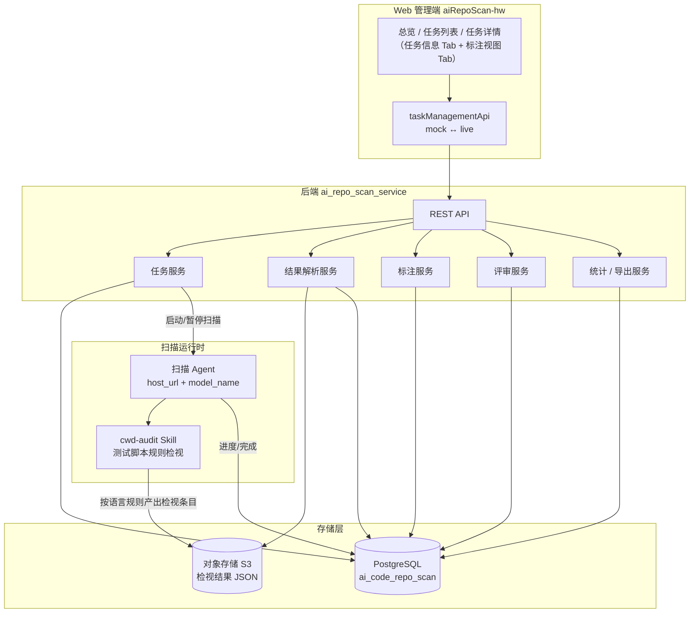
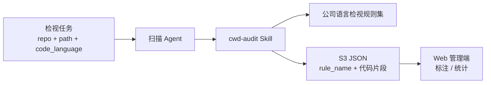
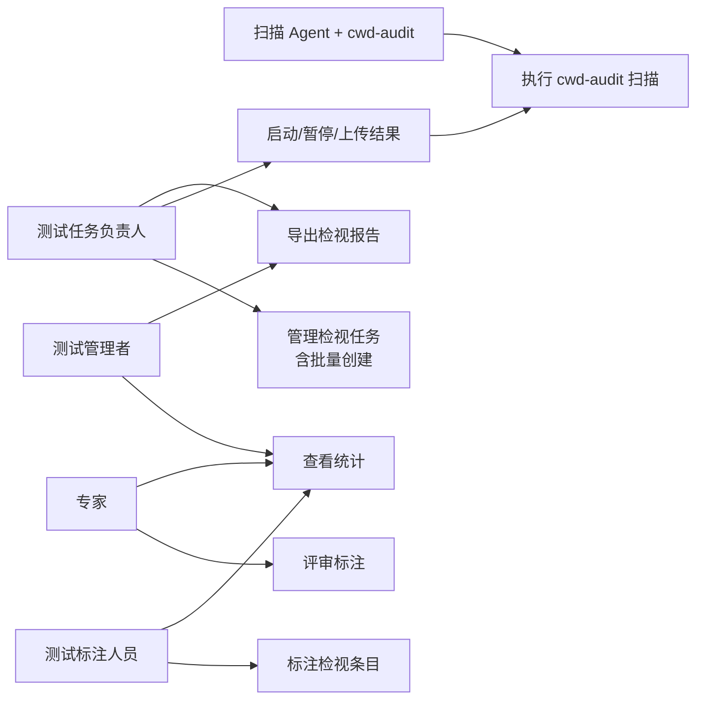
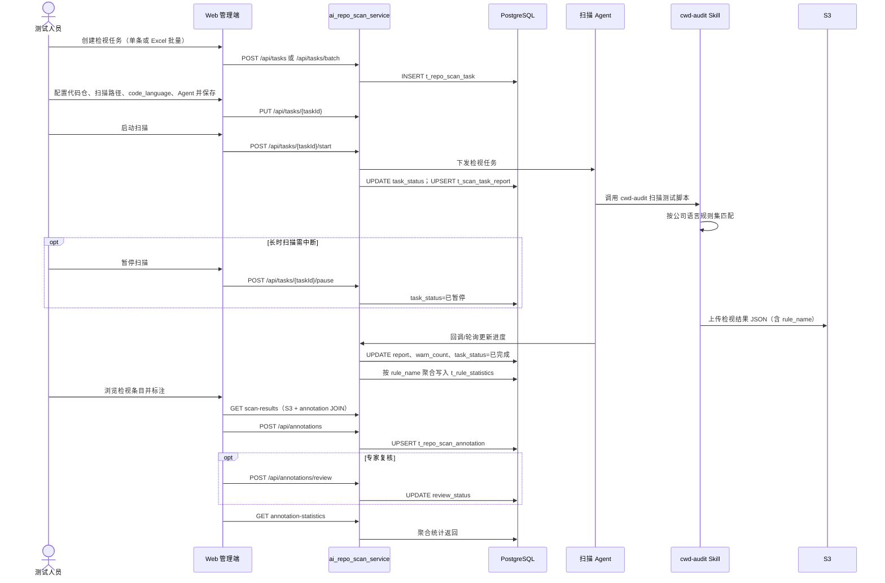
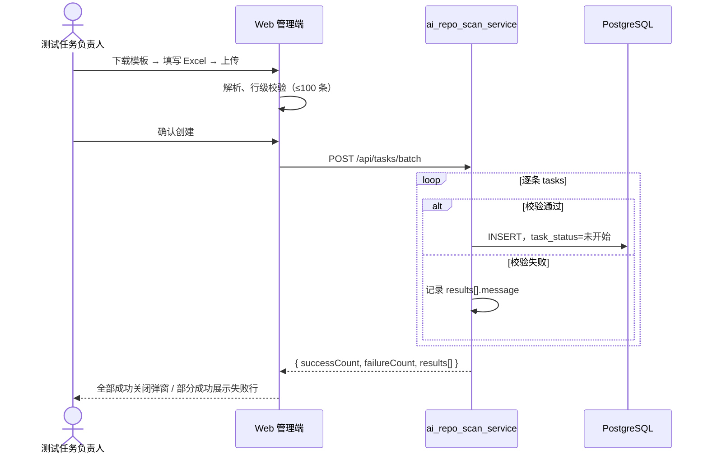
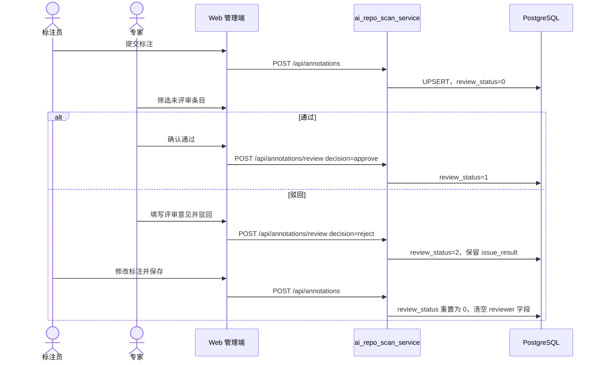
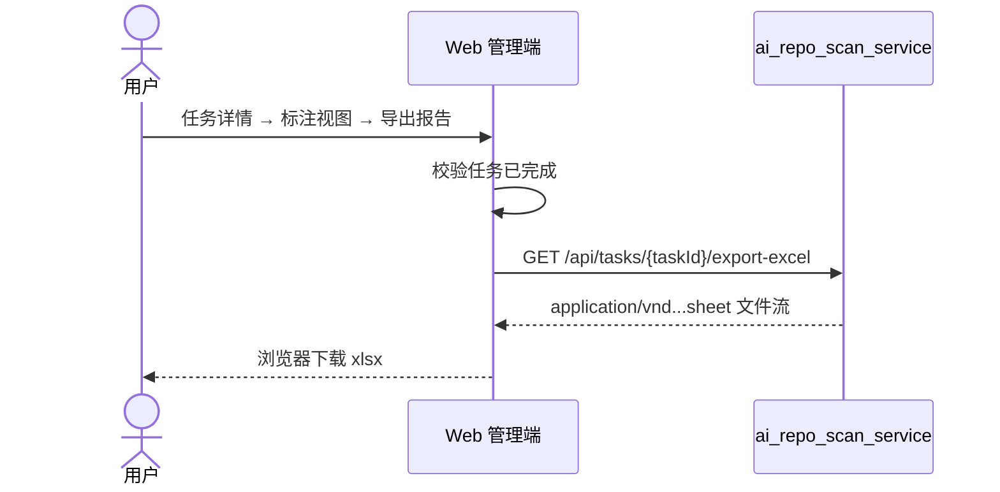
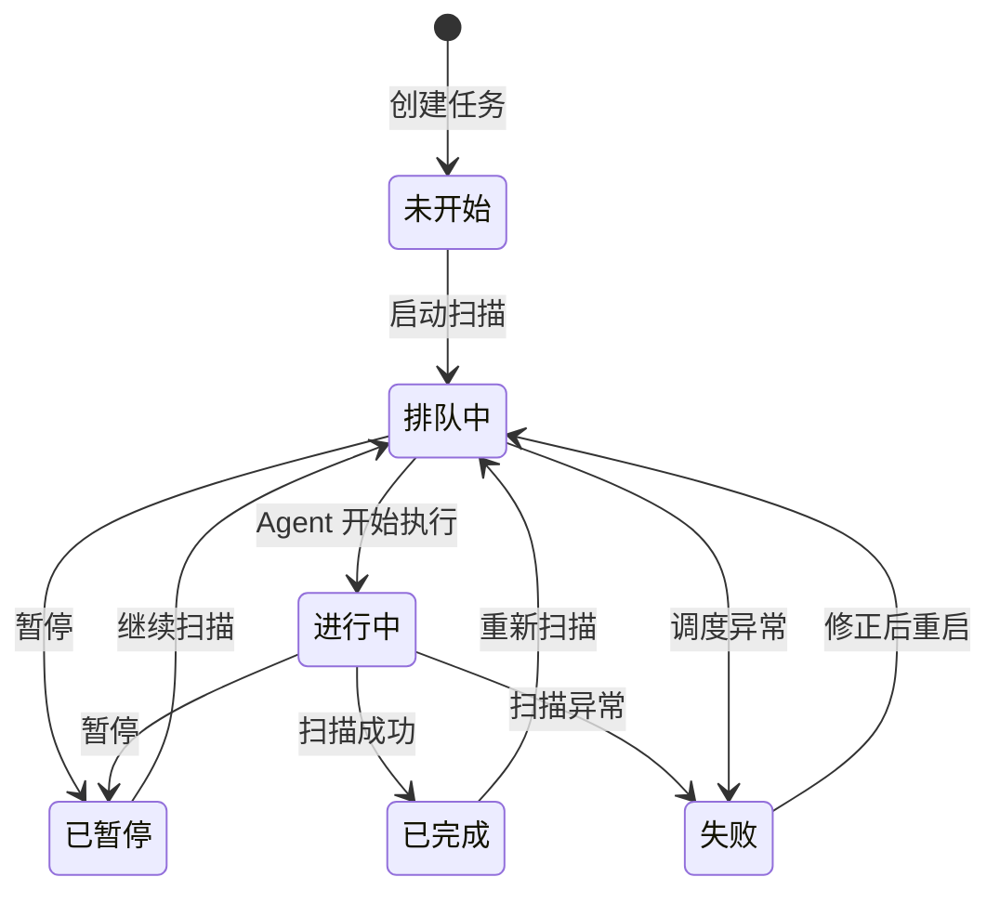
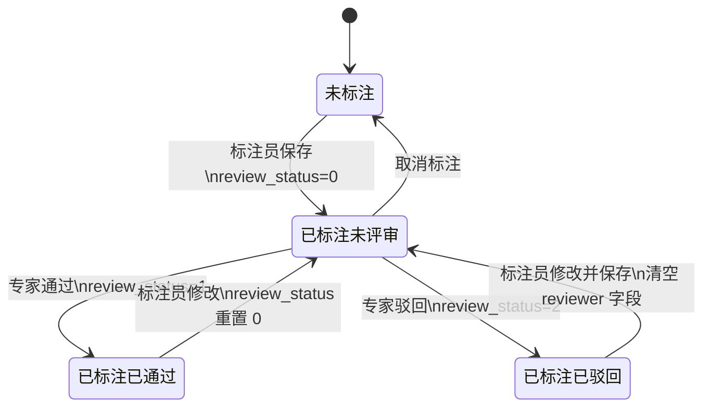
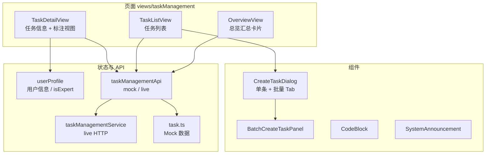

# AI 代码仓扫描结果管理平台 - 产品设计文档

本文档描述 **aiRepoScan** 全栈方案（Web 管理端、后端 API 服务、扫描执行、PostgreSQL 持久化、S3 结果存储），按「需求分析 → 整体作业流分析 → 具体功能实现 → DFX 分析 → 测试分析」组织。

**文档读者**：产业测试人员。本文档说明测试作业中如何管理代码仓检视任务、处理扫描结果、完成标注与复核闭环。

**扫描场景**：对业务代码仓中的**测试脚本**发起检视时，由扫描 Agent 调用 `**cwd-audit` Skill** 执行扫描；产出结果为按**公司对应编程语言规范**（如 C/C++ 内存安全等检视规则）匹配得到的告警条目，每条结果以 `rule_name` 标识所违反的规则。

**代码仓说明**：本仓库 `aiRepoScan-hw` 为 **Web 管理端**实现；后端服务为 `ai_repo_scan_service`。前端通过 `taskManagementApi` 统一封装 REST 调用，支持 `mock` / `live` 模式切换（见 `taskManagementApiConfig.ts`）。

---

## 1. 需求分析

### 1.1 项目概述

产业测试人员对业务代码仓中的测试脚本开展规范检视时，通过 `**cwd-audit` Skill** 触发扫描，得到按公司语言规则匹配的检视结果（文件、行号、`rule_name`、说明、代码片段等）。结果以 JSON 形式产出后，若缺少任务化管理能力，则难以支撑**多人协作标注、专家复核与治理统计**。

| 维度         | 说明                                                                               |
| ---------- | -------------------------------------------------------------------------------- |
| **项目定位**   | 产业测试脚本检视结果管理与标注平台，覆盖「任务编排 → cwd-audit 扫描 → 结果入库 → 人工标注 → 专家复核 → 统计复盘」            |
| **核心目标**   | 将 cwd-audit 产出的分散检视条目转为可检索、可标注、可统计的数据资产，支撑测试质量治理闭环                               |
| **扫描方式**   | 扫描 Agent 在指定代码仓路径上调用 `**cwd-audit` Skill**；`code_language`、扫描助手版本等任务参数决定适用的语言规则集 |
| **检视结果含义** | 每条告警为某条**公司语言检视规则**的命中记录；`rule_name` 对应规则名称，需由测试人员判定是否为真实问题                      |
| **系统组成**   | Web 管理端、后端 REST 服务、扫描 Agent（本机/远程）、`cwd-audit` Skill、PostgreSQL、对象存储 S3          |
| **业务边界**   | 平台负责任务与结果管理、标注协作与统计；**规则定义与扫描执行由 `cwd-audit` Skill 承担**，平台不内置规则引擎                |

### 1.2 目标用户

平台主要服务产业测试团队，各角色在 cwd-audit 检视结果上的协作分工如下：

| 角色          | 核心痛点               | 典型场景                                           | 期望价值          |
| ----------- | ------------------ | ---------------------------------------------- | ------------- |
| **测试任务负责人** | 多仓测试脚本检视任务分散、进度不可见 | 创建/批量创建任务、配置代码仓与 Agent、启动/暂停 cwd-audit 扫描、上传结果 | 以任务维度统一管理检视作业 |
| **测试标注人员**  | 规则命中条目多、需逐条核对脚本与规范 | 按 `rule_name`/标注/评审状态筛选，对检视条目提交三态结论与原因         | 高效完成规范符合性判定   |
| **专家（评审人）** | 需对测试人员初判结论做质量把关    | 筛选「未评审」条目执行通过/驳回；驳回后标注员修改重提                    | 仅「已通过」视为最终确认  |
| **测试管理者**   | 缺乏检视完成度与规则命中分布     | 查看标注完成率、规则 Top N、语言规则分布、导出离线分析                 | 驱动测试脚本质量治理与复盘 |

**核心业务流程**：创建检视任务（可批量）→ 配置代码仓、扫描路径、语言与 Agent → 启动 cwd-audit 扫描（可暂停/继续）或上传既有结果 → 任务完成 → 对规则检视条目标注 → 专家复核 → 统计看板复盘 / 导出报告。

### 1.3 功能需求

#### 1.3.1 平台总览

| 功能点       | 设计说明                                 |
| --------- | ------------------------------------ |
| 汇总指标卡片    | 进入总览即可掌握任务总量、进行中、已完成、扫描告警合计          |
| 任务状态分布图   | 以饼图或柱状图展示各状态任务占比，支撑全局资源与进度判断         |
| 缺陷/标注全局统计 | 跨任务汇总缺陷类型与标注状态分布，支撑治理复盘              |
| 最近任务与趋势   | 展示最近创建的任务列表并可跳转详情；支持按时间查看任务创建与缺陷发现趋势 |

#### 1.3.2 任务管理

| 功能点     | 设计说明                                                                            |
| ------- | ------------------------------------------------------------------------------- |
| 任务视图    | 提供「全部任务 / 我的任务」切换，按创建人筛选，便于定位个人作业                                               |
| 筛选与分页   | 支持任务名称、部门、PDU、任务状态模糊搜索与分页；筛选条件同步至 URL query，从详情返回时可恢复                           |
| 单条创建任务  | 填写任务名、产品名、代码仓 URL、分支、测试脚本扫描路径、代码语言（`code_language`）、助手版本等，生成可追踪的检视任务            |
| 批量创建任务  | 通过 Excel 模板一次导入最多 100 条；支持预填 `hostUrl` / `modelName`；按行校验，合法行入库、非法行返回原因，不回滚已成功行 |
| 编辑任务    | 更新仓库、分支、路径、Agent 配置、组织信息及重启扫描策略（重新扫描 / 继续扫描）                                    |
| 删除任务    | 仅创建人可删；**排队中、进行中**状态不可删                                                         |
| 启动扫描    | 校验 `hostUrl`、`modelName` 后触发扫描，更新任务状态与执行报告                                      |
| 暂停/继续扫描 | 排队中或进行中可暂停为「已暂停」；已暂停任务可通过「继续扫描」恢复执行                                             |
| 上传扫描结果  | 支持在无 Agent 或离线场景下，手动上传扫描结果 JSON 并关联至任务                                          |

#### 1.3.3 扫描结果与标注

| 功能点     | 设计说明                                                                    |
| ------- | ----------------------------------------------------------------------- |
| 结果存储    | 告警明细存 S3；任务元数据、标注与统计存 PostgreSQL                                        |
| 结果查询与展示 | 分页返回检视条目；展示文件、规则名称（`rule_name`）、行号、规范说明、代码片段；提供规则树与关键词搜索，便于按语言规则定位      |
| 人工标注    | 对 cwd-audit 检视条目标注三态结论（需要修改 / 无需修改 / 问题误报）及原因                           |
| 标注权限    | 未标注条目任何人可首次提交；已标注条目仅**首次标注人**可修改或取消                                     |
| 标注评审    | 专家对已标注条目给出通过或驳回；`review_status` 区分未评审/已通过/已驳回；驳回后保留初判内容供修改；仅「已通过」视为业务终态 |
| 规则统计    | 按任务聚合各语言检视规则（`rule_name`）命中数，支持 Top N 展示与手动重新统计                         |
| 扫描结果导出  | 将任务下全量扫描告警及标注、评审信息导出为 Excel，供离线共享与二次分析                                  |

**标注与评审枚举（开发对照）**：

| 类型             | 值            | 含义                               |
| -------------- | ------------ | -------------------------------- |
| `issueResult`  | 未写入 / `null` | 未标注                              |
|                | `0`          | 需要修改                             |
|                | `1`          | 无需修改                             |
|                | `2`          | 问题误报                             |
| `reviewStatus` | `0`          | 未评审（已标注 ≠ 已确认）                   |
|                | `1`          | 已通过（业务终态）                        |
|                | `2`          | 已驳回（保留 `issueResult`，修改后重置为 `0`） |

#### 1.3.4 统计看板（任务维度）

| 统计项        | 设计说明                       |
| ---------- | -------------------------- |
| 总缺陷数       | 展示本次 cwd-audit 扫描命中的检视条目总量 |
| 标注完成度      | 展示已标注与未标注条数及完成率            |
| 标注状态分布     | 按需要修改、无需修改、问题误报、未标注等维度展示占比 |
| 专家评审进度     | 展示未评审、已通过、已驳回条数            |
| 规则分布 Top N | 展示命中次数最多的规则；支持展开查看全部规则分布   |

#### 1.3.5 扩展功能

| 功能        | 设计说明                               |
| --------- | ---------------------------------- |
| 统一登录鉴权    | 接入 SSO 或网关注入用户身份；按 IAM 角色区分专家与普通用户 |
| 平台级聚合 API | 总览图表、趋势等由后端一次返回，避免前端多次拉取任务列表       |
| 标注提交/评审历史 | 按告警维度记录标注提交与评审变更历史，支持时间线查看与审计      |

### 1.4 非功能需求

| 类别        | 需求描述                                | 验收口径                                                      |
| --------- | ----------------------------------- | --------------------------------------------------------- |
| **性能**    | 单任务告警可达数千条                          | 扫描结果服务端分页；规则统计预聚合 + 可重算                                   |
| **可用性**   | 创建、启动、标注、导出等关键操作反馈明确                | 前后端统一错误码与 `ElMessage` 提示                                  |
| **安全与权限** | 删除、标注修改、评审受身份与业务规则约束                | 后端鉴权为准；前端体验层拦截（如仅标注人可改）                                   |
| **可靠性**   | 扫描失败可追踪、可重试                         | `t_scan_task_report` 记录进度与错误                              |
| **可扩展性**  | 扫描 Agent、`cwd-audit` Skill、语言规则集可替换 | 任务表保留 `host_url`、`model_name`、`code_language`、`commit_id` |

---

## 2. 整体作业流分析

### 2.1 系统架构

**分层职责**：

| 层级                  | 职责                                                      |
| ------------------- | ------------------------------------------------------- |
| **Web 管理端**         | 检视任务 CRUD、批量导入、启动/暂停扫描、检视结果浏览与标注、专家评审、规则统计、Excel 导出     |
| **后端 API 服务**       | 任务生命周期、S3 结果读写、标注/评审持久化、规则命中统计、权限校验、导出文件流               |
| **扫描 Agent**        | 接收启动指令，拉取代码仓指定路径，调度 `**cwd-audit` Skill**，回写执行报告        |
| **cwd-audit Skill** | 对测试脚本执行公司语言规范检视，产出含 `rule_name` 的 JSON 结果并上传 S3         |
| **PostgreSQL**      | 任务元数据、标注记录、规则统计、扫描执行报告                                  |
| **S3**              | 检视结果 JSON（条目主体，按 `warn_uuid` 标识；`rule_name` 为公司语言检视规则名） |

#### 2.1.1 cwd-audit 扫描作业流

产业测试人员创建任务并指定代码仓、扫描路径、`code_language`（如 C/C++）后，扫描 Agent 调用 `**cwd-audit` Skill** 对目标测试脚本执行检视。Skill 依据任务配置的语言规则集逐条匹配，将命中结果写入 S3；平台侧不对规则内容做二次解析，仅负责结果的管理、展示与标注协作。

### 2.2 用例视图

### 2.3 核心时序

#### 2.3.1 任务创建到标注

#### 2.3.2 批量创建任务

#### 2.3.3 标注评审

#### 2.3.4 扫描结果导出

### 2.4 任务状态机

| 状态  | 含义             | 系统行为                         |
| --- | -------------- | ---------------------------- |
| 未开始 | 任务已创建          | 可编辑；可启动扫描                    |
| 排队中 | 已提交启动，等待 Agent | 不可重复启动；可暂停；不可删除              |
| 进行中 | Agent 执行中      | 写 `progress`；可暂停；不可删除        |
| 已暂停 | 用户主动暂停         | 可继续扫描；不可删除（与排队/进行中同级保护）      |
| 已完成 | 结果已就绪          | 开放标注、统计、导出；可重新扫描             |
| 失败  | 扫描异常           | `error_messages` 记录原因；可修正后重启 |

### 2.5 标注与评审状态机

---

## 3. 具体功能实现

### 3.1 逻辑视图：数据与存储分工

| 数据类型      | 存储位置                     | 说明                                                                  |
| --------- | ------------------------ | ------------------------------------------------------------------- |
| 任务元数据     | `t_repo_scan_task`       | 仓库、分支、状态、S3 路径、告警总数、Agent 配置等                                       |
| 扫描执行过程    | `t_scan_task_report`     | 进度、起止时间、发现告警数、错误信息                                                  |
| 告警明细      | **S3 JSON**              | 以 `warn_uuid` 为键；含文件路径、`**rule_name`（公司语言检视规则名）**、行号、规范说明、测试脚本代码片段等 |
| 人工标注（当前态） | `t_repo_scan_annotation` | 与 `warn_uuid` + `task_id` 关联；含标注结论与评审状态                             |
| 规则统计      | `t_rule_statistics`      | 任务维度规则命中缓存，供看板加速                                                    |

**查询路径**：S3 读取 JSON → 按页切片 → LEFT JOIN `t_repo_scan_annotation` 填充 `annotation` 嵌套对象。

**标注/评审写入规则**：

- 标注员保存：写入 `issue_result`、`reason`；`**review_status` 置 `0`**；若此前已驳回，清空 `reviewer_`*、`review_comment`。
- 专家通过：`review_status = 1`，写入评审人与时间，可选 `final_issue_result`。
- 专家驳回：`review_status = 2`，**保留**标注员初判；`review_comment` 必填。
- 取消标注：`issueResult = null`，删除或失效标注记录。

### 3.2 数据库设计

**Schema**：`ai_code_repo_scan`（PostgreSQL）

#### 3.2.1 扫描任务表 `t_repo_scan_task`

| 字段                   | 类型            | 约束/默认                     | 说明                                        |
| -------------------- | ------------- | ------------------------- | ----------------------------------------- |
| `task_id`            | varchar(225)  | PK, NOT NULL              | 任务 ID                                     |
| `task_name`          | varchar(100)  | NOT NULL                  | 任务名称                                      |
| `branch`             | varchar(100)  |                           | 扫描分支                                      |
| `path_list`          | text          |                           | 扫描路径（逗号分隔）                                |
| `s3_path`            | varchar(225)  |                           | 扫描结果 JSON 在 S3 的路径                        |
| `creator`            | varchar(50)   |                           | 创建人短工号                                    |
| `creator_name`       | varchar(16)   |                           | 创建人中文名                                    |
| `create_time`        | timestamp(6)  | DEFAULT pg_systimestamp() | 创建时间                                      |
| `task_status`        | varchar(20)   |                           | 未开始/排队中/进行中/已暂停/已完成/失败                    |
| `repo_url`           | varchar(255)  |                           | 代码仓地址                                     |
| `assistant_versions` | varchar(255)  |                           | 扫描助手版本（逗号分隔）                              |
| `product_name`       | varchar(100)  |                           | 产品名称                                      |
| `code_language`      | varchar(50)   |                           | 检视所依据的编程语言（决定 cwd-audit 适用的公司规则集，如 C/C++） |
| `line_num`           | numeric(10,1) |                           | 扫描代码量（k）                                  |
| `dept_name`          | varchar(100)  |                           | 部门                                        |
| `pdu_name`           | varchar(100)  |                           | PDU                                       |
| `warn_count`         | numeric(8,0)  |                           | 告警总数                                      |
| `host_url`           | varchar(255)  |                           | 扫描 Agent URL                              |
| `model_name`         | varchar(255)  |                           | 扫描模型名称                                    |
| `commit_id`          | varchar(255)  |                           | 扫描对应代码提交 ID                               |

#### 3.2.2 标注表 `t_repo_scan_annotation`

| 字段                   | 类型           | 约束/默认               | 说明                       |
| -------------------- | ------------ | ------------------- | ------------------------ |
| `id`                 | int8         | PK, 序列              | 标注记录 ID                  |
| `warn_uuid`          | varchar(36)  | NOT NULL            | 告警 UUID                  |
| `task_id`            | varchar(225) |                     | 所属任务                     |
| `user_id`            | varchar(50)  | NOT NULL            | 标注人短工号                   |
| `user_name`          | varchar(100) |                     | 标注人姓名                    |
| `user_department`    | varchar(100) |                     | 标注人部门                    |
| `issue_result`       | int2         | NOT NULL            | 0 需要修改 / 1 无需修改 / 2 问题误报 |
| `reason`             | text         |                     | 标注原因                     |
| `annotation_status`  | int2         | NOT NULL, DEFAULT 1 | 1 已标注                    |
| `review_status`      | int2         | NOT NULL, DEFAULT 0 | 0 未评审 / 1 已通过 / 2 已驳回    |
| `reviewer_user_id`   | varchar(50)  |                     | 最近一次评审人短工号               |
| `review_time`        | timestamp(6) |                     | 最近一次评审时间                 |
| `review_comment`     | text         |                     | 评审意见                     |
| `final_issue_result` | int2         |                     | 可选：专家确认后的最终结论            |
| `create_time`        | timestamp(6) | NOT NULL            | 创建时间                     |
| `update_time`        | timestamp(6) | NOT NULL            | 更新时间                     |

**索引建议**：`(task_id, review_status)` 用于列表筛选；`(task_id, warn_uuid)` 唯一约束。

#### 3.2.3 规则统计表 `t_rule_statistics`

| 字段            | 类型           | 说明                       |
| ------------- | ------------ | ------------------------ |
| `id`          | int4 PK      | 主键                       |
| `task_id`     | varchar(255) | 任务 ID                    |
| `rule_name`   | varchar(255) | 公司语言检视规则名称（cwd-audit 产出） |
| `rule_count`  | int4         | 命中告警数                    |
| `update_time` | timestamp(6) | 统计更新时间                   |

#### 3.2.4 扫描执行报告表 `t_scan_task_report`

| 字段                           | 类型              | 说明             |
| ---------------------------- | --------------- | -------------- |
| `task_id`                    | varchar(255) PK | 任务 ID（与任务 1:1） |
| `commit_id`                  | varchar(255)    | 本次扫描 commit    |
| `updater`                    | varchar(255)    | 进度更新来源         |
| `progress`                   | varchar(255)    | 执行进度描述         |
| `found_warnings`             | int4            | 已发现告警数（执行中增量）  |
| `start_time` / `finish_time` | timestamp(6)    | 起止时间           |
| `error_messages`             | text            | 失败时的错误信息       |

### 3.3 接口设计

**服务前缀**：`{base}/ai_repo_scan_service`  
**统一响应**：`{ data, meta }`，成功时 `meta.isSuccess = true`。

| 能力     | 方法与路径                                           |
| ------ | ----------------------------------------------- |
| 查询任务列表 | `GET /api/tasks`                                |
| 查询任务信息 | `GET /api/tasks/{taskId}/info`                  |
| 查询扫描结果 | `GET /api/tasks/{taskId}/scan-results`          |
| 创建任务   | `POST /api/tasks`                               |
| 批量创建任务 | `POST /api/tasks/batch`                         |
| 更新任务   | `PUT /api/tasks/{taskId}`                       |
| 删除任务   | `DELETE /api/tasks/{taskId}`                    |
| 启动扫描   | `POST /api/tasks/{taskId}/start`                |
| 暂停扫描   | `POST /api/tasks/{taskId}/pause`                |
| 上传结果文件 | `POST /api/tasks/{taskId}/uploadDataSet`        |
| 标注统计   | `GET /api/tasks/{taskId}/annotation-statistics` |
| 重新统计规则 | `POST /api/tasks/{taskId}/rerunStatistics`      |
| 保存标注   | `POST /api/annotations`                         |
| 标注评审   | `POST /api/annotations/review`                  |
| 导出扫描结果 | `GET /api/tasks/{taskId}/export-excel`          |

**关键约定**：

- **任务列表** query：`pageNum`、`pageSize` 必填；可选 `creator`、`taskStatus`、`taskName`、`deptName`、`pduName`（服务端模糊搜索）。
- **扫描结果** query：`pageNum`、`pageSize` 必填；可选 `ruleName`、`annotation`（`unmarked` / `0` / `1` / `2`）、`reviewStatus`（`0` / `1` / `2`）。
- **保存标注**：`issueResult = null` 表示取消；保存后 `reviewStatus` 重置为 `0`；驳回后修改须清空 reviewer 相关字段。
- **标注评审**：仅 `reviewStatus=0` 且已标注可操作；驳回时 `comment` 必填；通过时可传可选 `finalIssueResult`。
- **批量创建**：顶层统一 `creator` / `nameCn`；`tasks.length` 1～100；按行独立成功/失败，部分成功仍 HTTP 200；`rowIndex` = 数组下标 + 1。
- **导出**：仅 `taskStatus=已完成`；导出任务**全量**结果（不受列表筛选影响）；响应为 xlsx 文件流，文件名由 `Content-Disposition` 返回。
- **字段命名**：数据库 snake_case ↔ 接口 camelCase（如 `creator_name` → `nameCn`）。

### 3.5 技术选型与 Web 管理端实现

#### 3.5.1 技术选型

| 层级      | 选型                            | 用途                  |
| ------- | ----------------------------- | ------------------- |
| Web 管理端 | Vue 3 + Vue Router + Pinia    | 任务与标注交互             |
| Web UI  | Element Plus + ECharts        | 组件与规则分布图            |
| Web 构建  | Vite 7                        | 前端工程化               |
| 工具库     | xlsx                          | Excel 模板生成与 Mock 导出 |
| 后端      | REST（`ai_repo_scan_service`）  | 任务、结果、标注、统计 API     |
| 数据库     | PostgreSQL                    | 任务、标注、统计、执行报告       |
| 对象存储    | S3                            | 扫描结果 JSON           |
| 扫描运行时   | Agent + `**cwd-audit` Skill** | 对测试脚本执行公司语言规范检视     |

#### 3.5.2 Web 端模块结构

| 路由          | 页面   | 核心能力                                                                |
| ----------- | ---- | ------------------------------------------------------------------- |
| `/overview` | 总览   | 任务总数/进行中/已完成/告警合计（已实现）；图表区占位                                        |
| `/tasks`    | 任务列表 | 全部/我的、筛选、分页、创建（含批量）、删除、跳转详情                                         |
| `/task/:id` | 任务详情 | **任务信息 Tab**：编辑、启动/暂停/继续扫描、上传结果、统计看板；**标注视图 Tab**：结果列表、标注、评审、规则树、导出 |

**关键实现文件**：

| 能力     | 主要文件                                                                         |
| ------ | ---------------------------------------------------------------------------- |
| 批量创建   | `CreateTaskDialog.vue`、`BatchCreateTaskPanel.vue`、`utils/batchTaskImport.ts` |
| 标注与评审  | `taskDetailView.vue`；评审权限 `userProfile.isExpert()`                           |
| 导出     | `utils/scanResultExport.ts` → `exportTaskScanResultsExcel`                   |
| 任务常量   | `constants/scanTaskConst.ts`（含「已暂停」状态）                                       |
| API 切换 | `taskManagementApiConfig.ts` 中 `apiMode`；`VITE_API_REPO_SCAN` 指向 live 服务     |

**标注视图交互要点**（指导联调）：

- 左侧：扫描结果卡片列表，支持标注三态、原因、取消；专家在「未评审」行展示通过/驳回。
- 筛选：标注结果下拉 + 评审状态下拉；与服务端 query 对齐。
- 右侧：规则名称树（点击按 `ruleName` 过滤）；关键词本地过滤文件/规则/说明。
- 统计看板（任务信息 Tab）：任务「已完成」且有告警时展示；含「重新统计」按钮调用 `rerunStatistics`。
- 导出：标注视图标题栏「导出报告」，loading + Toast 反馈。

本地开发默认 `apiMode = 'mock'`；联调时将 `apiMode` 改为 `live` 并配置 `VITE_API_REPO_SCAN`。

---

## 4. DFX 分析

### 4.1 性能

| 问题       | 场景           | 解决方案                                        | 状态                    |
| -------- | ------------ | ------------------------------------------- | --------------------- |
| 大结果集查询   | 单任务 1000+ 告警 | S3 结果服务端分页；按需 JOIN 标注                       | 已解决                   |
| 规则统计重复计算 | 频繁打开看板       | `t_rule_statistics` 预聚合 + `rerunStatistics` | 已解决                   |
| 平台总览聚合   | 任务量大         | 前端多次 `queryTaskList` 拉全量算告警合计               | 临时方案；overview API 规划中 |
| 全量导出     | 数千条导出        | 服务端流式生成 xlsx                                | 已实现                   |

### 4.2 可靠性

| 问题          | 场景       | 解决方案                            | 状态       |
| ----------- | -------- | ------------------------------- | -------- |
| 扫描中途失败      | Agent 异常 | `error_messages` + 状态「失败」       | 已设计      |
| 扫描可中断       | 长时任务     | 暂停 → 已暂停 → 继续扫描                 | 已实现（Web） |
| S3 与 DB 不一致 | 上传失败     | 上传成功后再更新 `s3_path`、`warn_count` | 已实现      |
| 标注并发        | 多人改同一告警  | 首次标注人锁定；唯一约束 + 403              | 已实现      |
| 批量创建部分失败    | 部分行非法    | 按行 `results`，不回滚已成功行            | 已实现      |
| 评审与标注竞态     | 驳回同时修改   | 评审 API 条件更新；冲突 409              | 设计中      |

### 4.3 可维护性

| 问题             | 解决方案                            | 状态  |
| -------------- | ------------------------------- | --- |
| 结果 JSON 结构演进   | 版本字段 + 后端兼容层                    | 进行中 |
| 前后端字段映射        | 本章接口约定；camelCase/snake_case 转换层 | 进行中 |
| Mock / Live 切换 | 单一 `taskManagementApi` 门面       | 已实现 |

### 4.4 安全

| 问题      | 解决方案                            | 状态       |
| ------- | ------------------------------- | -------- |
| 身份鉴权    | SSO + API 层校验 creator / 标注人     | 部分接入     |
| 评审权限    | 评审接口校验专家角色；前端 `isExpert()` 控制按钮 | 已实现（Web） |
| S3 路径泄露 | 预签名 URL 或网关代理                   | 待加固      |

### 4.5 可扩展性

| 问题          | 解决方案                              | 状态           |
| ----------- | --------------------------------- | ------------ |
| 标注复核        | 主表 `review_status` 扩展，无独立历史表      | 已实现          |
| 多 commit 扫描 | `commit_id` + 报告表记录历次执行           | 字段已预留        |
| 标注历史审计      | `submit-history` / `timeline` API | 接口已定义，UI 待开发 |

### 4.6 DFX 评分（当前）

| 维度          | 权重      | 得分     | 说明                                     |
| ----------- | ------- | ------ | -------------------------------------- |
| D - 可开发性    | 30      | 29     | 表结构清晰，Mock/Live 门面降低联调成本               |
| F - 功能可用性   | 40      | 36     | 任务→扫描→标注→评审→导出主链路完整；总览图表待完善            |
| X - 可扩展与可运维 | 30      | 27     | 暂停扫描、执行报告、rerunStatistics 支持运维；SSO 待补齐 |
| **总分**      | **100** | **92** | Web 端核心功能已落地，平台级聚合与 live 全链路联调后可达验收    |

---

## 5. 测试分析

### 5.1 场景功能测试

| 类型  | 测试场景              | 检查点                                               |
| --- | ----------------- | ------------------------------------------------- |
| 正常  | 单条创建任务            | PG 新增行，`task_status=未开始`                          |
| 正常  | Excel 批量创建（2 条合法） | `successCount=2`；各行 `task_status=未开始`             |
| 正常  | 批量部分成功            | HTTP 200；`failureCount=1`；非法行无 INSERT             |
| 异常  | 批量空列表 / 超 100 条   | 400，`meta.isSuccess=false`                        |
| 正常  | 批量预填 Agent        | `host_url`、`model_name` 已写入，可直接 start             |
| 正常  | 任务列表筛选 + URL 恢复   | `taskName`/`deptName`/`pduName` 模糊匹配；返回列表保留 query |
| 正常  | 启动扫描              | 状态→排队中/进行中；`t_scan_task_report` 有记录               |
| 正常  | 暂停 / 继续扫描         | 排队中/进行中可暂停为已暂停；继续后重新排队                            |
| 异常  | 重复启动（进行中）         | 400，状态不变                                          |
| 正常  | 扫描完成              | `task_status=已完成`，`warn_count`、`s3_path` 正确       |
| 正常  | 分页查结果 + 规则树筛选     | 返回条数 ≤ pageSize；`ruleName` 过滤生效                   |
| 正常  | 保存 / 修改 / 取消标注    | `review_status` 正确重置；他人修改 403                     |
| 正常  | 评审通过 / 驳回         | `review_status` 1/2；驳回保留 `issue_result`           |
| 正常  | 驳回后修改重提           | `review_status` 重置 0；reviewer 字段清空                |
| 正常  | 评审状态筛选            | `reviewStatus=0` 仅返回未评审                           |
| 正常  | 标注统计与看板           | 完成度、分布、评审计数与 DB 一致                                |
| 正常  | 重新统计规则            | `rerunStatistics` 后 `t_rule_statistics` 刷新        |
| 正常  | 导出 Excel          | 已完成任务可下载；条数与 `warn_count` 一致                      |
| 权限  | 删除任务              | 非创建人拒绝；排队中/进行中不可删                                 |
| 边界  | 零告警任务             | 空态展示，非 500                                        |
| E2E | 创建→启动→标注→评审→导出    | 各层数据一致                                            |

### 5.2 建议测试分层

| 层级  | 范围                                         |
| --- | ------------------------------------------ |
| 单元  | 结果 JSON 解析、标注权限、评审状态机、`batchTaskImport` 校验 |
| 集成  | API ↔ PostgreSQL ↔ S3；启动/暂停与报告回写           |
| E2E | Web 批量创建 → 标注 → 评审 → 导出；mock 与 live 双模式    |

---

*文档版本：面向产业测试人员；扫描执行依赖 `**cwd-audit` Skill**，检视结果按公司对应语言规则产出；Web 管理端以 `aiRepoScan-hw` 为准。*

**修订记录**

| 日期         | 说明                  |
| ---------- | ------------------- |
| 2026-06-08 | 任务列表新增部门名称、PDU 名称筛选 |
| 2026-06-09 | 新增批量创建任务设计          |
| 2026-06-21 | 移除关联文档引用，保证本文档独立性   |

